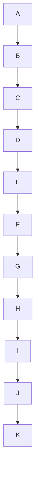
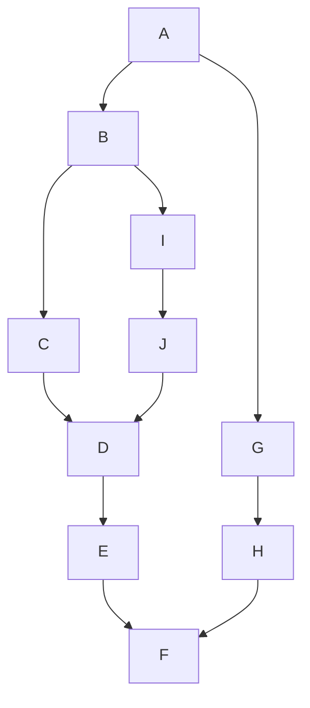
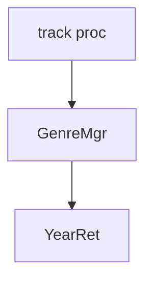

# Mermaid Diagrams for Documentation

Use Mermaid diagrams instead of plain text when documenting:
- Architecture (layers, components, dependencies)
- Data flows and processes
- State machines and workflows
- Entity relationships
- Sequence diagrams

## Why Mermaid?

✅ **Benefits:**
- Visual clarity > wall of text
- Renders in GitHub, GitLab, modern markdown viewers
- Version-controllable (text-based)
- Easy to update and maintain
- No external image files needed

❌ **Avoid Mermaid for:**
- Simple lists (use markdown lists)
- Linear steps (use numbered lists)
- Very complex diagrams (use proper diagramming tool + image)

## STEP 1: Identify Diagram Type

Match your content to the right Mermaid diagram:

| Content Type | Diagram Type | Example |
|--------------|--------------|---------|
| System architecture, layers | `graph TD` or `graph LR` | Application → Domain → Infrastructure |
| Process flow, pipeline | `flowchart` or `graph` | Request → Validate → Process → Respond |
| State transitions | `stateDiagram-v2` | Draft → Review → Approved → Published |
| Component interactions | `sequenceDiagram` | User → API → Database → Cache |
| Class hierarchy | `classDiagram` | Parent ← Child1, Child2 |
| Entity relationships | `erDiagram` | User ||--o{ Order : places |
| Timeline/roadmap | `gantt` | Q1 tasks, Q2 milestones |

## STEP 2: Mermaid Syntax Guidelines

### Architecture Diagrams (graph TD/LR)

```markdown
​```mermaid
graph TD
    A[Component A] --> B[Component B]
    A --> C[Component C]
    B --> D{Decision}
    D -->|Yes| E[Action 1]
    D -->|No| F[Action 2]

    classDef important fill:#f96,stroke:#333,stroke-width:4px
    class A important
​```
```

**Best Practices:**
- Use `TD` (top-down) for hierarchies
- Use `LR` (left-right) for flows/pipelines
- Keep to 6-12 nodes max (readability)
- Use subgraphs for grouping
- Apply CSS classes for emphasis

### Flowcharts

```markdown
​```mermaid
flowchart LR
    Start([Start]) --> Input[/User Input/]
    Input --> Validate{Valid?}
    Validate -->|No| Error[Show Error]
    Validate -->|Yes| Process[Process Data]
    Process --> Output[(Database)]
    Error --> Input
    Output --> End([End])
​```
```

**Node Shapes:**
- `[Rectangle]` - process/step
- `([Rounded])` - start/end
- `{Diamond}` - decision
- `[(Cylinder)]` - database
- `[/Parallelogram/]` - input/output

### Sequence Diagrams

```markdown
​```mermaid
sequenceDiagram
    participant User
    participant API
    participant Cache
    participant DB

    User->>API: Request data
    API->>Cache: Check cache
    alt Cache hit
        Cache-->>API: Return cached
    else Cache miss
        API->>DB: Query database
        DB-->>API: Return data
        API->>Cache: Update cache
    end
    API-->>User: Response
​```
```

### State Diagrams

```markdown
​```mermaid
stateDiagram-v2
    [*] --> Draft
    Draft --> Review: submit()
    Review --> Approved: approve()
    Review --> Draft: reject()
    Approved --> Published: publish()
    Published --> [*]
​```
```

## STEP 3: Integration Checklist

When adding Mermaid to documentation:

1. **Precede with context paragraph**
   ```markdown
   The application follows a clean architecture with 4 layers:

   ​```mermaid
   graph TD
       ...
   ​```
   ```

2. **Add diagram title** (optional but helpful)
   ```markdown
   ​```mermaid
   ---
   title: System Architecture Overview
   ---
   graph TD
       ...
   ​```
   ```

3. **Follow with explanation** if complex
   ```markdown
   ​```mermaid
   graph TD
       A --> B
   ​```

   **Key Components:**
   - A: Handles requests
   - B: Processes data
   ```

4. **Keep it simple**
   - Max 12 nodes per diagram
   - Split complex systems into multiple diagrams
   - One diagram = one concept

5. **Use consistent naming**
   - Match code names (e.g., `TrackProcessor`, not "Track Handler")
   - Use full names, not abbreviations (unless defined)

## STEP 4: Common Patterns

### Layered Architecture

```markdown
​```mermaid
graph TD
    subgraph "Application Layer"
        CLI[CLI]
        Orchestrator[Orchestrator]
    end

    subgraph "Domain Layer"
        Logic[Business Logic]
    end

    subgraph "Infrastructure"
        API[External APIs]
        DB[(Database)]
    end

    CLI --> Orchestrator
    Orchestrator --> Logic
    Logic --> API
    Logic --> DB
​```
```

### Data Flow Pipeline

```markdown
​```mermaid
flowchart LR
    Input[Raw Data] --> Validate{Valid?}
    Validate -->|Yes| Transform[Transform]
    Validate -->|No| Error[Log Error]
    Transform --> Cache[(Cache)]
    Cache --> Output[Clean Data]
​```
```

### Dependency Injection

```markdown
​```mermaid
graph TD
    Container[DI Container]
    Container --> |provides| ServiceA
    Container --> |provides| ServiceB
    ServiceA --> |uses| ServiceB
    Client --> |requests| Container
​```
```

## Anti-Patterns

❌ **Too many nodes**

*Solution: Split into multiple diagrams or use subgraphs*

❌ **No context**
```markdown
​```mermaid
graph TD
    A-->B
​```
```
*Solution: Add paragraph explaining what A and B represent*

❌ **Overcomplicated**

*Solution: Simplify or use proper tool (Lucidchart, draw.io)*

❌ **Inconsistent naming**

*Solution: Use full, consistent names from codebase*

## Examples from This Project

### Architecture Layers
```markdown
​```mermaid
graph TD
    subgraph Application["Application Layer (src/application)"]
        Orchestrator[Orchestrator]
        CLI[CLI Parser]
        Config[Config Manager]
    end

    subgraph Domain["Domain Layer (src/domain)"]
        TrackProcessor[Track Processor]
        GenreManager[Genre Manager]
        YearRetriever[Year Retriever]
    end

    subgraph Infrastructure["Infrastructure Layer (src/infrastructure)"]
        AppleScript[AppleScript Client]
        APIs[External APIs]
        Cache[Cache Services]
    end

    CLI --> Orchestrator
    Orchestrator --> TrackProcessor
    TrackProcessor --> GenreManager
    TrackProcessor --> YearRetriever
    GenreManager --> Cache
    YearRetriever --> APIs
    TrackProcessor --> AppleScript
​```
```

### Track Update Flow
```markdown
​```mermaid
flowchart LR
    Start([User Command]) --> Fetch[Fetch Tracks]
    Fetch --> Cache{In Cache?}
    Cache -->|Yes| Validate[Validate Data]
    Cache -->|No| AppleScript[Run AppleScript]
    AppleScript --> Parse[Parse Output]
    Parse --> Validate
    Validate --> Process[Process Updates]
    Process --> Write[Write to Music.app]
    Write --> End([Complete])
​```
```

## Quick Reference

| Need to show... | Use... |
|----------------|--------|
| System components and how they connect | `graph TD` with subgraphs |
| Step-by-step process | `flowchart LR` |
| Request/response between services | `sequenceDiagram` |
| Status transitions | `stateDiagram-v2` |
| Database schema | `erDiagram` |
| Class inheritance | `classDiagram` |

## Testing Diagrams

Before committing:
1. Preview in VS Code with Mermaid extension
2. Check on GitHub (create draft PR if needed)
3. Verify all node names match codebase
4. Ensure it renders correctly (syntax errors = blank diagram)

## When NOT to Use This Skill

- Writing code (use language-specific tools)
- Creating UI mockups (use Figma/Sketch)
- Documenting APIs (use OpenAPI/Swagger)
- Simple bullet lists (use markdown)
- Very complex diagrams >15 nodes (use specialized tool + embed image)
