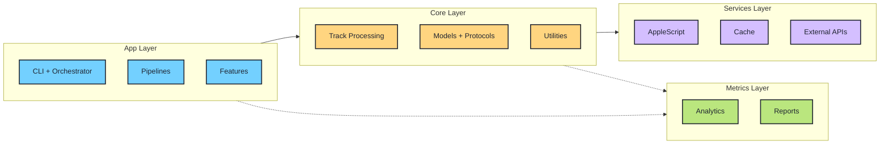
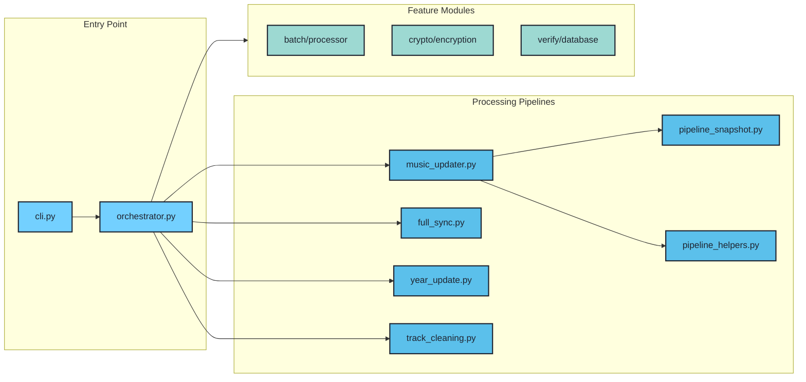
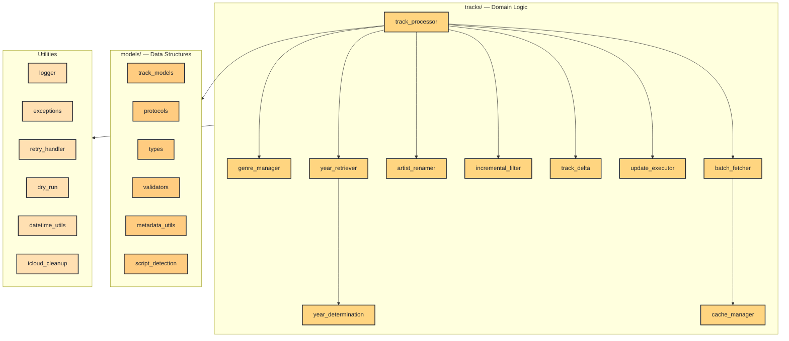
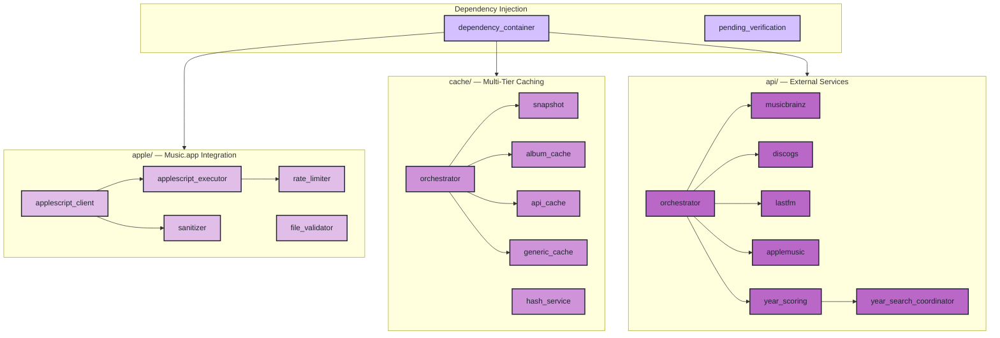
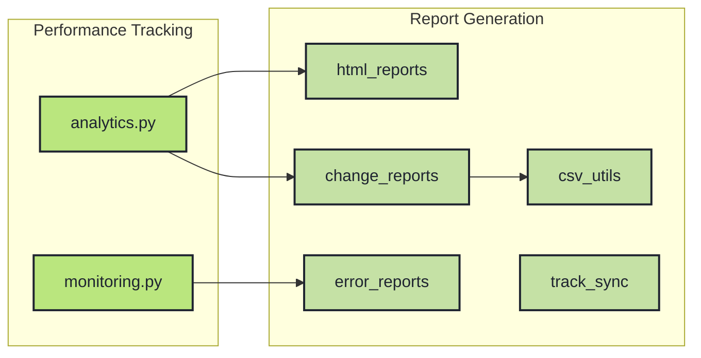

# Music Genre Updater


<p align="center">
  
  
  <a href="https://github.com/barad1tos/GenreUpdater/actions/workflows/ci.yml"></a>
  <a href="https://codecov.io/gh/barad1tos/GenreUpdater"></a>
  
</p>

Automatically updates **genres** and **release years** for your Apple Music tracks.

## What It Does

1. **Fixes messy genres** — If an artist has 80 rock tracks and 5 pop tracks, the tool sets all their tracks to "Rock" (the dominant genre)

2. **Fills in missing years** — Looks up actual release years from MusicBrainz, Discogs, and Last.fm, then writes them to your library

3. **Cleans up metadata** — Removes "Remastered", "Deluxe Edition", and other clutter from track names

4. **Previews before changing** — Run with `--dry-run` to see what would change without touching your library

<details>
<summary>Technical details: Performance & Security (v2.0)</summary>

### Performance

- **Library Snapshot Caching** — Load 30,000+ tracks in under 1 second from disk cache
- **Incremental Delta Updates** — Process only tracks changed since last run (based on `date_modified`)
- **Multi-Tier Caching** — Three levels: Memory (L1, <1ms) → Disk JSON (L2, 10-50ms) → Snapshot (L3, <1s for 30K)
- **Async/Await Architecture** — All I/O operations are non-blocking (aiohttp, aiofiles)
- **Parse Failure Tolerance** — Automatically recovers from up to 3 consecutive AppleScript parse failures

### Security

- **Encrypted Configuration** — API keys stored using Fernet symmetric encryption (cryptography library)
- **Key Rotation** — Built-in `rotate_keys` command to rotate encryption keys
- **Database Verification** — `verify_database` command checks track database integrity against Music.app
- **Input Validation** — All AppleScript inputs sanitized to prevent injection attacks

</details>

## Quick Start

**Requirements:** macOS 10.15+, Python 3.13+, Apple Music app

```bash
# Install
curl -LsSf https://astral.sh/uv/install.sh | sh
git clone https://github.com/barad1tos/GenreUpdater.git
cd GenreUpdater && uv sync

# Configure
cp config.yaml my-config.yaml
# Edit my-config.yaml with your paths

# Run
uv run python main.py --dry-run  # Preview first
uv run python main.py            # Apply changes
```

<details>
<summary>Alternative: Traditional pip/venv installation</summary>

```bash
git clone https://github.com/barad1tos/GenreUpdater.git
cd GenreUpdater

# Create and activate virtual environment
python3.13 -m venv .venv
source .venv/bin/activate

# Install package in editable mode
pip install -e .

# Verify
python main.py --help
```

**Dependencies** (from pyproject.toml):
- pydantic 2.x — Data validation
- aiohttp — Async HTTP client
- aiofiles — Async file I/O
- cryptography — API key encryption
- orjson — Fast JSON parsing
- rich — Terminal formatting

</details>

## Usage

```bash
# Basic commands
uv run python main.py                    # Full update (genres + years)
uv run python main.py --dry-run          # Preview without changing
uv run python main.py --force            # Bypass cache, process everything

# Specific operations
uv run python main.py clean_artist --artist "Pink Floyd"
uv run python main.py update_years --artist "Otep"
uv run python main.py verify_database
```

<details>
<summary>All commands and flags reference</summary>

### Global Flags

| Flag | Description |
|------|-------------|
| `--force` | Bypass incremental checks and cache, process all tracks |
| `--dry-run` | Preview changes without writing to Music.app |
| `--test-mode` | Run only on artists listed in `development.test_artists` config |
| `--verbose`, `-v` | Enable debug-level logging |
| `--quiet`, `-q` | Suppress non-critical console output |
| `--config PATH` | Use custom config file (default: `my-config.yaml` → `config.yaml`) |

### Commands

| Command | Alias | Description |
|---------|-------|-------------|
| _(default)_ | — | Full library update: fetch all tracks, update genres and years |
| `clean_artist` | `clean` | Remove "Remastered", "Deluxe" etc. from specific artist's tracks |
| `update_years` | `years` | Fetch release years from APIs without updating genres |
| `revert_years` | `revert` | Rollback year changes using `changes_report.csv` or custom backup |
| `verify_database` | `verify-db` | Check that cached track IDs still exist in Music.app |
| `verify_pending` | `pending` | Retry year lookups for albums that previously failed |
| `batch` | — | Process multiple artists from a text file |
| `rotate_keys` | `rotate-keys` | Generate new encryption key and re-encrypt all API tokens |

### Command Examples

```bash
# Revert year changes for specific album
uv run python main.py revert_years --artist "Otep" --album "The God Slayer"

# Revert using backup CSV
uv run python main.py revert_years --artist "Otep" --backup-csv /path/to/backup.csv

# Batch process artists from file (one artist per line)
uv run python main.py batch --file artists.txt --operation full

# Available operations: clean, years, full
uv run python main.py batch --file artists.txt --operation years

# Rotate encryption keys (doesn't require Music.app)
uv run python main.py rotate_keys --new-password "optional-custom-password"
```

</details>

## Configuration

Edit `my-config.yaml` with your paths:

```yaml
music_library_path: /Users/you/Music/Music/Music Library.musiclibrary
apple_scripts_dir: /path/to/GenreUpdater/applescripts
logs_base_dir: /path/to/logs
```

<details>
<summary>Full configuration reference</summary>

```yaml
# ═══════════════════════════════════════════════════════════════
# CORE PATHS (required)
# ═══════════════════════════════════════════════════════════════
music_library_path: /Users/username/Music/Music/Music Library.musiclibrary
apple_scripts_dir: /path/to/GenreUpdater/applescripts
logs_base_dir: /path/to/logs

# ═══════════════════════════════════════════════════════════════
# APPLESCRIPT SETTINGS
# ═══════════════════════════════════════════════════════════════
apple_script_concurrency: 2  # Max parallel AppleScript calls (2-3 safe, >5 causes race conditions)

applescript_timeouts:
  single_artist_fetch: 600   # 10 min — timeout for fetching one artist's tracks
  full_library_fetch: 3600   # 1 hour — timeout for full library scan
  batch_update: 60           # 1 min — timeout per batch update operation

# ═══════════════════════════════════════════════════════════════
# BATCH PROCESSING
# ═══════════════════════════════════════════════════════════════
batch_processing:
  ids_batch_size: 200        # Tracks per batch when fetching by ID list
  enabled: true              # Enable batch mode

# ═══════════════════════════════════════════════════════════════
# LIBRARY SNAPSHOT (for 30K+ libraries)
# ═══════════════════════════════════════════════════════════════
library_snapshot:
  enabled: true              # Cache full library state to disk
  snapshot_dir: cache/snapshots
  delta_enabled: true        # Only fetch changed tracks on subsequent runs
  hash_algorithm: sha256     # Integrity verification

# ═══════════════════════════════════════════════════════════════
# INCREMENTAL UPDATES
# ═══════════════════════════════════════════════════════════════
incremental_interval_minutes: 15  # Skip tracks not modified in last N minutes

# ═══════════════════════════════════════════════════════════════
# RETRY CONFIGURATION
# ═══════════════════════════════════════════════════════════════
max_retries: 2               # Retry failed track updates
retry_delay_seconds: 1       # Delay between retries

# ═══════════════════════════════════════════════════════════════
# ANALYTICS & LOGGING
# ═══════════════════════════════════════════════════════════════
analytics:
  enabled: true
  max_events: 1000
  duration_thresholds:
    short_max: 2             # <2s = green (fast)
    medium_max: 5            # 2-5s = gray (normal)
    long_max: 10             # 5-10s = pink (slow), >10s = needs optimization

logging:
  max_bytes: 5000000         # 5MB per log file
  backup_count: 1            # Keep 1 backup
  main_log_file: main/main.log
  year_changes_log_file: main/year_changes.log
  csv_output_file: csv/track_list.csv
  changes_report_file: csv/changes_report.csv
  analytics_log_file: analytics/analytics.log

# ═══════════════════════════════════════════════════════════════
# METADATA CLEANING
# ═══════════════════════════════════════════════════════════════
cleaning:
  remaster_keywords:
    - remaster
    - remastered
    - Re-recording
    - Redux
    - Expanded
    - Special Edition
    - Deluxe Edition
  album_suffixes_to_remove:
    - " - EP"
    - " - Single"

# ═══════════════════════════════════════════════════════════════
# EXCEPTIONS (skip these from processing)
# ═══════════════════════════════════════════════════════════════
exceptions:
  track_cleaning:
    - artist: "Example Artist"
      album: "Example Album"

# ═══════════════════════════════════════════════════════════════
# DEVELOPMENT / TESTING
# ═══════════════════════════════════════════════════════════════
test_artists: []             # Artists to process in --test-mode

experimental:
  batch_updates_enabled: false  # Experimental: batch AppleScript updates (~10x faster)
  max_batch_size: 5
```

</details>

<details>
<summary>Automation with launchctl (run on schedule)</summary>

Create `~/Library/LaunchAgents/com.barad1tos.MusicGenreUpdater.plist`:

```xml
<?xml version="1.0" encoding="UTF-8"?>
<!DOCTYPE plist PUBLIC "-//Apple//DTD PLIST 1.0//EN" "http://www.apple.com/DTDs/PropertyList-1.0.dtd">
<plist version="1.0">
<dict>
    <key>Label</key>
    <string>com.barad1tos.MusicGenreUpdater</string>

    <key>ProgramArguments</key>
    <array>
        <string>/path/to/GenreUpdater/.venv/bin/python</string>
        <string>/path/to/GenreUpdater/main.py</string>
    </array>

    <key>StartInterval</key>
    <integer>1800</integer>  <!-- Run every 30 minutes (1800 seconds) -->

    <key>WorkingDirectory</key>
    <string>/path/to/GenreUpdater</string>

    <key>StandardOutPath</key>
    <string>/path/to/logs/launchctl_stdout.log</string>

    <key>StandardErrorPath</key>
    <string>/path/to/logs/launchctl_stderr.log</string>

    <key>EnvironmentVariables</key>
    <dict>
        <key>PATH</key>
        <string>/usr/local/bin:/usr/bin:/bin</string>
    </dict>
</dict>
</plist>
```

**Commands:**

```bash
# Load (start running on schedule)
launchctl load ~/Library/LaunchAgents/com.barad1tos.MusicGenreUpdater.plist

# Check if running
launchctl list | grep com.barad1tos.MusicGenreUpdater

# Unload (stop)
launchctl unload ~/Library/LaunchAgents/com.barad1tos.MusicGenreUpdater.plist

# Run immediately (for testing)
launchctl start com.barad1tos.MusicGenreUpdater
```

</details>

## Architecture

The code is organized into four layers. You don't need to understand this to use the tool.

<details>
<summary>Architecture diagram and code structure</summary>

### Overview



---

### App Layer (`src/app/`)



---

### Core Layer (`src/core/`)



---

### Services Layer (`src/services/`)



---

### Metrics Layer (`src/metrics/`)



---

### Layer Responsibilities

| Layer | Path | What it does |
|-------|------|--------------|
| **App** | `src/app/` | CLI parsing, command routing, pipelines (sync, year update, cleaning), feature modules |
| **Core** | `src/core/` | Domain logic: track processing, genre/year determination, artist renaming, filtering, models |
| **Services** | `src/services/` | Infrastructure: AppleScript client, multi-tier cache, external API clients (MB/Discogs/Last.fm) |
| **Metrics** | `src/metrics/` | Observability: analytics decorators, HTML/CSV reports, error tracking, monitoring |

### Key Design Patterns

- **Dependency Injection** — `DependencyContainer` creates and wires all services at startup
- **Protocol-Based Interfaces** — `AppleScriptClientProtocol`, `CacheServiceProtocol` enable testing with mocks
- **Multi-Tier Caching** — Memory (L1) → Disk (L2) → Snapshot (L3) for optimal performance
- **Contextual Logging** — Every log entry includes `artist | album | track` context for debugging

### Caching Performance

| Tier | Storage | Latency | TTL | Use Case |
|------|---------|---------|-----|----------|
| L1 | Memory (dict) | <1ms | Session | Hot data, repeated access |
| L2 | Disk (JSON) | 10-50ms | 20min | API responses |
| L3 | Snapshot (pickle) | <1s for 30K | Permanent | Full library state |

### AppleScript Integration

Scripts in `applescripts/` directory:

| Script | Purpose | Output Format |
|--------|---------|---------------|
| `fetch_tracks.scpt` | Get all tracks or filtered by artist | ASCII-delimited: `\x1E` (field), `\x1D` (record) |
| `fetch_tracks_by_ids.scpt` | Get specific tracks by ID list | Same format |
| `update_property.applescript` | Set single track property | "Success: ..." or "No Change: ..." |
| `batch_update_tracks.applescript` | Batch updates (experimental) | JSON status array |

</details>

## Troubleshooting

| Problem | Solution |
|---------|----------|
| "Music app is not running" | Launch Music.app before running (except `rotate_keys`) |
| AppleScript timeout | Increase `applescript_timeouts` values in config |
| Cache corruption | Delete `cache/` directory and re-run |
| Parse failures in batch | Reduce `batch_processing.ids_batch_size` (try 100) |

<details>
<summary>Diagnostic commands</summary>

```bash
# Check Python version (must be 3.13+)
python3 --version

# Test AppleScript connection
osascript applescripts/fetch_tracks.scpt "" 0 10  # Fetch first 10 tracks

# Check launch agent status
launchctl list | grep com.barad1tos.MusicGenreUpdater

# Watch logs in real-time
tail -f /path/to/logs/main/main.log

# Check for errors
grep -i error /path/to/logs/main/main.log | tail -20
```

</details>

<details>
<summary>Log file locations</summary>

All paths relative to `logs_base_dir` in config:

| File | Contents |
|------|----------|
| `main/main.log` | Main application log (INFO level) |
| `main/year_changes.log` | Year update decisions and API responses |
| `csv/track_list.csv` | Full track listing from last run |
| `csv/changes_report.csv` | All changes made (for revert) |
| `csv/dry_run_report.csv` | Changes that would be made (dry-run) |
| `analytics/analytics.log` | Function timing and call counts |
| `analytics/reports/analytics.html` | Visual performance dashboard |

</details>

## FAQ

<details>
<summary>How do I change update frequency?</summary>

Two settings control this:

1. **launchctl interval** — `StartInterval` in plist (seconds between runs)
2. **Incremental filter** — `incremental_interval_minutes` in config.yaml (skip tracks not modified recently)

Example: Run every hour, but only process tracks modified in last 30 minutes:
- plist: `<integer>3600</integer>` (1 hour)
- config: `incremental_interval_minutes: 30`

</details>

<details>
<summary>How can I see what was changed?</summary>

Check `<logs_base_dir>/csv/changes_report.csv`. Contains:
- Track ID, name, artist, album
- Old and new values for genre/year
- Timestamp of change

Use this file with `revert_years` command to undo changes.

</details>

<details>
<summary>Can I exclude specific artists or albums?</summary>

Yes, add to `exceptions.track_cleaning` in config:

```yaml
exceptions:
  track_cleaning:
    - artist: "Weird Al Yankovic"  # Skip all albums
    - artist: "Pink Floyd"
      album: "The Wall"            # Skip specific album
```

</details>

<details>
<summary>Why are some years wrong?</summary>

Year determination uses scoring from 3 APIs. Sometimes:
- APIs disagree on release year
- Remastered versions have different years
- Regional releases vary

Use `revert_years` to fix, then add to exceptions.

</details>

<details>
<summary>Is it safe to run on my library?</summary>

Yes, with caveats:
1. **Always run `--dry-run` first** to preview changes
2. **Changes sync to iCloud immediately** and cannot be undone via Time Machine
3. **Use `revert_years`** with `changes_report.csv` to undo year changes
4. Genre changes have no built-in revert (restore from backup if needed)

</details>

## Contributing

See [CONTRIBUTING.md](CONTRIBUTING.md) for guidelines.

<details>
<summary>Development setup</summary>

```bash
# Clone and setup
git clone https://github.com/yourusername/GenreUpdater.git
cd GenreUpdater
git checkout -b feature/your-feature
uv sync

# Run tests
uv run pytest tests/unit/ -v --cov=src

# Linting
uv run ruff check src/ tests/
uv run ruff format src/ tests/

# Type checking
uv run mypy src/

# Security scan
uv run bandit -r src/ -c pyproject.toml
```

</details>

## Links

- [Changelog](CHANGELOG.md) — Version history
- [Contributing](CONTRIBUTING.md) — Development guidelines
- [Security](SECURITY.md) — Vulnerability reporting
- [License](LICENSE) — MIT

## Contact

**Author:** Roman Borodavkin
- Email: [roman.borodavkin@gmail.com](mailto:roman.borodavkin@gmail.com)
- GitHub: [@barad1tos](https://github.com/barad1tos)

---

> **Warning:** Changes sync to iCloud immediately and cannot be easily reverted.
> Always use `--dry-run` first!
