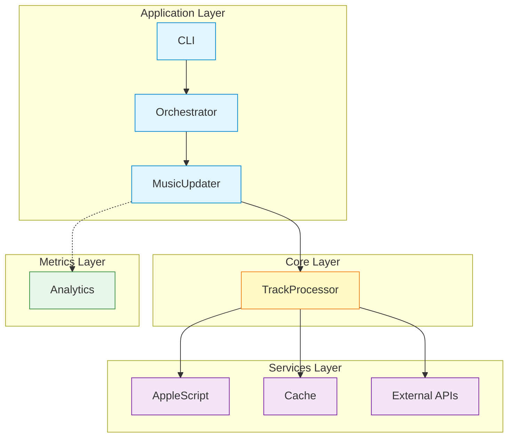

# Music Genre Updater


<p align="center">
  
  
  <a href="https://github.com/barad1tos/GenreUpdater/actions/workflows/ci.yml"></a>
  <a href="https://codecov.io/gh/barad1tos/GenreUpdater"></a>
  
</p>

Automatically updates **genres** and **release years** for your Apple Music tracks.
Analyzes your library, determines the dominant genre per artist, and fetches accurate
release years from MusicBrainz, Discogs, and Last.fm.

## Features

- **Auto Genre** - Sets the dominant genre for each artist
- **Auto Year** - Fetches release years from 3 music databases
- **Large Libraries** - Handles 30,000+ tracks efficiently
- **Safe** - Dry-run mode to preview changes first

<details>
<summary>More features (v2.0)</summary>

**Performance:**

- Library snapshot caching (load 30K tracks in <1s)
- Incremental updates (process only changed tracks)
- Multi-tier caching: Memory → Disk → Snapshot
- Fully async I/O operations

**Security:**

- Encrypted API key storage
- Key rotation command
- Database integrity verification
- Input validation

</details>

## Quick Start

**Requirements:** macOS 10.15+, Python 3.13+, Apple Music

```bash
# Install
curl -LsSf https://astral.sh/uv/install.sh | sh
git clone https://github.com/barad1tos/GenreUpdater.git
cd GenreUpdater && uv sync

# Configure
cp config.yaml my-config.yaml
# Edit my-config.yaml with your paths

# Run
uv run python main.py --dry-run  # Preview first
uv run python main.py            # Apply changes
```

<details>
<summary>Alternative installation (pip/venv)</summary>

```bash
git clone https://github.com/barad1tos/GenreUpdater.git
cd GenreUpdater
python3.13 -m venv .venv
source .venv/bin/activate
pip install -e .
python main.py --help
```

</details>

## Usage

```bash
# Basic commands
uv run python main.py                    # Full update
uv run python main.py --dry-run          # Preview only
uv run python main.py --force            # Bypass cache

# Specific operations
uv run python main.py clean_artist --artist "Pink Floyd"
uv run python main.py update_years --artist "Otep"
uv run python main.py verify_database
```

<details>
<summary>All commands and flags</summary>

**Global Flags:**

| Flag            | Description                         |
|-----------------|-------------------------------------|
| `--force`       | Bypass cache and incremental checks |
| `--dry-run`     | Preview without applying            |
| `--test-mode`   | Use test_artists from config        |
| `--verbose`     | Verbose logging                     |
| `--config PATH` | Custom config file                  |

**Commands:**

| Command           | Alias         | Description                |
|-------------------|---------------|----------------------------|
| _(default)_       | -             | Full library update        |
| `clean_artist`    | `clean`       | Clean artist metadata      |
| `update_years`    | `years`       | Fetch release years        |
| `revert_years`    | `revert`      | Rollback year changes      |
| `verify_database` | `verify-db`   | Check database integrity   |
| `verify_pending`  | `pending`     | Retry failed verifications |
| `batch`           | -             | Process artists from file  |
| `rotate_keys`     | `rotate-keys` | Rotate encryption keys     |

**Examples:**

```bash
# Revert year changes
uv run python main.py revert_years --artist "Otep" --album "The God Slayer"

# Batch processing
uv run python main.py batch --file artists.txt --operation full

# Rotate encryption keys
uv run python main.py rotate_keys
```

</details>

## Configuration

Edit `my-config.yaml` with your paths:

```yaml
music_library_path: /Users/you/Music/Music/Music Library.musiclibrary
apple_scripts_dir: /path/to/GenreUpdater/applescripts
logs_base_dir: /path/to/logs
```

<details>
<summary>Full configuration reference</summary>

```yaml
# Core Paths
music_library_path: /Users/username/Music/Music/Music Library.musiclibrary
apple_scripts_dir: /path/to/applescripts
logs_base_dir: /path/to/logs

# AppleScript Settings
apple_script_concurrency: 2
applescript_timeouts:
  single_artist_fetch: 600   # 10 minutes
  full_library_fetch: 3600   # 1 hour
  batch_update: 60           # 1 minute

# Batch Processing
batch_processing:
  ids_batch_size: 200
  enabled: true

# Library Snapshot
library_snapshot:
  enabled: true
  snapshot_dir: cache/snapshots
  delta_enabled: true

# Analytics
analytics:
  duration_thresholds:
    short_max: 2   # green
    medium_max: 5  # gray
    long_max: 10   # pink

# Exceptions (skip these from cleaning)
exceptions:
  track_cleaning:
    - artist: "Artist Name"
      album: "Album Name"

# Cleaning keywords
cleaning:
  remaster_keywords:
    - remaster
    - remastered
    - deluxe
  album_suffixes_to_remove:
    - " - EP"
    - " - Single"
```

</details>

<details>
<summary>Automation with launchctl</summary>

Create `~/Library/LaunchAgents/com.barad1tos.MusicGenreUpdater.plist`:

```xml
<?xml version="1.0" encoding="UTF-8"?>
<!DOCTYPE plist PUBLIC "-//Apple//DTD PLIST 1.0//EN" "http://www.apple.com/DTDs/PropertyList-1.0.dtd">
<plist version="1.0">
    <dict>
        <key>Label</key>
        <string>com.barad1tos.MusicGenreUpdater</string>
        <key>ProgramArguments</key>
        <array>
            <string>/path/to/.venv/bin/python</string>
            <string>/path/to/GenreUpdater/main.py</string>
        </array>
        <key>StartInterval</key>
        <integer>1800</integer>
        <key>WorkingDirectory</key>
        <string>/path/to/GenreUpdater</string>
    </dict>
</plist>
```

```bash
# Load agent (runs every 30 minutes)
launchctl load ~/Library/LaunchAgents/com.barad1tos.MusicGenreUpdater.plist

# Check status
launchctl list | grep com.barad1tos.MusicGenreUpdater

# Unload
launchctl unload ~/Library/LaunchAgents/com.barad1tos.MusicGenreUpdater.plist
```

</details>

## Architecture

Four-layer clean architecture:



<details>
<summary>Detailed architecture</summary>

**Layers:**

| Layer    | Path            | Purpose                        |
|----------|-----------------|--------------------------------|
| App      | `src/app/`      | CLI, orchestration, features   |
| Core     | `src/core/`     | Business logic, models, tracks |
| Services | `src/services/` | AppleScript, cache, APIs       |
| Metrics  | `src/metrics/`  | Analytics, monitoring, reports |

**Key patterns:**

- Dependency Injection via `DependencyContainer`
- Protocol-based interfaces for testing
- Multi-tier caching: Memory → Disk → Snapshot
- Contextual logging: `artist | album | track`

**Caching performance:**

| Tier | Type        | Latency     |
|------|-------------|-------------|
| L1   | Memory      | <1ms        |
| L2   | Disk (JSON) | 10-50ms     |
| L3   | Snapshot    | <1s for 30K |

</details>

## Troubleshooting

| Problem                 | Solution                                  |
|-------------------------|-------------------------------------------|
| "Music app not running" | Launch Music.app first                    |
| AppleScript timeout     | Increase `applescript_timeouts` in config |
| Cache corruption        | Delete `cache/` directory                 |
| Parse failures          | Reduce `ids_batch_size` in config         |

<details>
<summary>Verification commands</summary>

```bash
# Check Python version
python3 --version  # Should be 3.13+

# Test AppleScript
osascript applescripts/fetch_tracks.scpt

# Check launch agent
launchctl list | grep com.barad1tos.MusicGenreUpdater

# View logs
tail -f /path/to/logs/main/main.log
```

</details>

<details>
<summary>Log files</summary>

- Main log: `<logs_base_dir>/main/main.log`
- Year changes: `<logs_base_dir>/main/year_changes.log`
- CSV reports: `<logs_base_dir>/csv/changes_report.csv`
- Analytics: `<logs_base_dir>/analytics/reports/analytics.html`

</details>

## FAQ

<details>
<summary>How do I adjust update frequency?</summary>

Modify `StartInterval` in the plist file (seconds) and `incremental_interval_minutes` in config.yaml.

</details>

<details>
<summary>How can I see what changes were made?</summary>

Check `<logs_base_dir>/csv/changes_report.csv` for all modifications.

</details>

<details>
<summary>Can I run multiple instances?</summary>

Not recommended. Use a single instance to avoid race conditions.

</details>

<details>
<summary>What happens if updates fail?</summary>

The script retries based on `max_retries` and `retry_delay_seconds` settings.
Failed updates are logged and the track remains unchanged.

</details>

## Contributing

See [CONTRIBUTING.md](CONTRIBUTING.md) for guidelines.

<details>
<summary>Quick dev setup</summary>

```bash
git clone https://github.com/yourusername/GenreUpdater.git
cd GenreUpdater
git checkout -b feature/your-feature
uv sync
uv run pytest
uv run ruff check src/
uv run mypy src/
```

</details>

## Links

- [Changelog](CHANGELOG.md)
- [Contributing](CONTRIBUTING.md)
- [Security](SECURITY.md)
- [License](LICENSE) (MIT)

## Contacts

**Author:** Roman Borodavkin

- Email: [roman.borodavkin@gmail.com](mailto:roman.borodavkin@gmail.com)
- GitHub: [@barad1tos](https://github.com/barad1tos)

---

> **Warning:** Changes sync to iCloud immediately and cannot be easily reverted.
> Always use `--dry-run` first!
