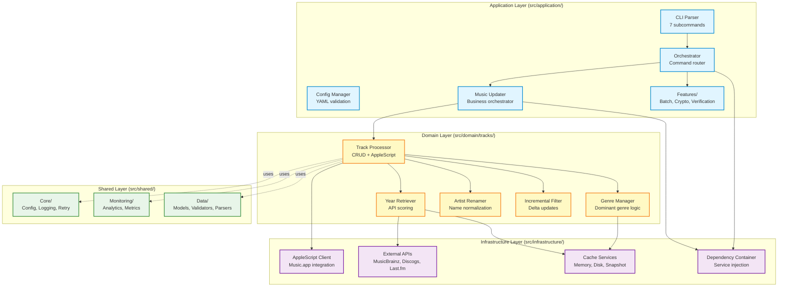

# Music Genre Updater


Music Genre Updater is a Python-based tool that automatically updates the genres and release years of your music tracks
in Apple Music.
By analyzing your music library, it determines the dominant genre for each artist and retrieves accurate release years
from multiple music databases. The system now includes sophisticated algorithms to handle edge cases,
batch processing for large libraries, and comprehensive contextual logging for better monitoring.

## Table of Contents

- [Music Genre Updater](#music-genre-updater)
    - [Table of Contents](#table-of-contents)
    - [Description](#description)
    - [Features](#features)
    - [Prerequisites](#prerequisites)
    - [Installation](#installation)
        - [Clone the Repository](#clone-the-repository)
        - [Set Up a Virtual Environment](#set-up-a-virtual-environment)
    - [Install Dependencies](#install-dependencies)
        - [Configuration](#configuration)
        - [Setting Up the Launch Agent with launchctl](#setting-up-the-launch-agent-with-launchctl)
    - [Usage](#usage)
        - [Running the Script Manually](#running-the-script-manually)
        - [Command-Line Arguments](#command-line-arguments)
        - [Examples](#examples)
        - [Revert and Repair](#revert-and-repair)
    - [Configuration Details](#configuration-details)
        - [config.yaml](#configyaml)
    - [Logging](#logging)
        - [Log Configuration](#log-configuration)
        - [Log Files](#log-files)
    - [Analytics Module](#analytics-module)
    - [Auxiliary Scripts](#auxiliary-scripts)
        - [AppleScript Scripts](#applescript-scripts)
    - [Contributing](#contributing)
    - [License](#license)
    - [Contacts](#contacts)
    - [Troubleshooting](#troubleshooting)
    - [FAQ](#faq)

## Description

**Music Genre Updater** is a Python-based tool designed to automatically update the genres and release years of your
music tracks in Apple Music.
By analyzing your music library, it identifies the dominant genre for each artist and retrieves accurate release years
from multiple online music databases (MusicBrainz, Discogs, Last.fm). The system uses batch processing to handle large
music libraries efficiently
and provides comprehensive contextual logging for better monitoring. This ensures that your music library remains
organized with accurate metadata
that reflects the true characteristics of your music.

## Architecture Overview

Music Genre Updater v2.0 follows a **clean architecture pattern** with clear separation of concerns:



### Key Design Patterns

- **Async/await throughout**: All I/O operations are async for maximum performance
- **Dependency injection**: `DependencyContainer` manages all service instances
- **Protocol-based interfaces**: Enables easy testing and mocking
- **Multi-tier caching**: Memory → Disk → Snapshot for optimal speed
- **Contextual logging**: Every log entry includes `artist | album | track` context
- **Batch processing**: Handles 30,000+ tracks efficiently with configurable batch sizes

## Features

### Core Functionality

- **Automatic Genre Updating:** Determines and updates the dominant genre for each artist based on sophisticated track
  analysis algorithms with configurable thresholds.
- **Automatic Year Updating:** Retrieves and updates accurate release years from multiple music databases (MusicBrainz,
  Discogs, Last.fm) with intelligent scoring.
- **Batch Processing:** Efficiently handles large music libraries (30,000+ tracks) using intelligent batch processing
  with
  automatic parse failure tolerance.
- **Contextual Logging:** Provides detailed, contextual logs showing `artist | album | track` information for better
  monitoring and debugging.
- **Smart Filtering:** Automatically detects and skips read-only tracks (prerelease, cloud status filtering).

### Performance & Scalability (New in v2.0)

- **Library Snapshot Caching:** Avoid full library rescans - load 30K+ tracks in <1 second from disk snapshot
- **Incremental Delta Updates:** Process only changed tracks since last run (date-based filtering)
- **Multi-Tier Caching:** Memory → Disk → Snapshot for optimal performance
- **Async/Await Architecture:** All I/O operations are async for maximum throughput
- **Parse Failure Tolerance:** Automatic recovery from up to 3 consecutive parse failures

### Security & Verification (New in v2.0)

- **Encrypted Configuration:** Secure storage for sensitive API keys using cryptography library
- **Key Rotation:** Built-in command to rotate encryption keys (`rotate_keys`)
- **Database Verification:** Integrity checks for track database (`verify_database` command)
- **Input Validation:** Security validators for all user-provided data and AppleScript inputs

### Developer Experience

- **YAML Configuration:** Comprehensive `config.yaml` with 50+ settings organized by category
- **Analytics Module:** Tracks execution time, overhead, and call counts with optional HTML reports
- **CSV Reporting:** Generates detailed CSV reports of all track changes
- **Exception Handling:** Supports artist/album exceptions to prevent unwanted modifications
- **Robust Error Handling:** Retries failed updates with exponential backoff and detailed error logging
- **Modern Tooling:** Uses `uv` for fast dependency management, `trunk` for linting

## Prerequisites

Before installing the Music Genre Updater, ensure you have the following:

- **Operating System:** macOS 10.15 (Catalina) or higher
- **Python:** Version 3.13 or higher (required)
- **uv:** Modern Python package manager (recommended for installation)
- **Apple Music:** Installed and running
- **Homebrew:** Recommended for managing packages (optional)

## Installation

### Method 1: Using uv (Recommended)

[uv](https://github.com/astral-sh/uv) is a modern, fast Python package manager.
This is the recommended installation method.

```bash
# Install uv if not already installed
curl -LsSf https://astral.sh/uv/install.sh | sh

# Clone the repository
git clone https://github.com/barad1tos/music-genre-updater.git
cd music-genre-updater

# Install all dependencies (automatically creates virtual environment)
uv sync

# Verify installation
uv run python main.py --help
```

### Method 2: Traditional pip/venv

If you prefer traditional Python tooling:

```bash
# Clone the repository
git clone https://github.com/barad1tos/music-genre-updater.git
cd music-genre-updater

# Create virtual environment
python3.13 -m venv .venv
source .venv/bin/activate

# Install dependencies
pip install -e .

# Verify installation
python main.py --help
```

**Note:** All project dependencies are managed through `pyproject.toml`. The application requires Python 3.13+ and
includes 15+ packages for async processing, API integration, caching, and monitoring.

### Configuration

Copy the example configuration file and customize it to fit your environment. Make sure the config is in the same
directory as the main script.

```bash
cp config.yaml /path/to/the/directory/config.yaml
```

Open `config.yaml` in your preferred text editor and update the paths and settings as needed. Detailed explanations of
each configuration parameter
are provided in the Configuration Details section below.

### Setting Up the Launch Agent with launchctl

To automate the execution of the Music Genre Updater, set up a launchctl agent:

1. Create the LaunchAgents Directory (if it doesn’t exist):

```bash
mkdir -p ~/Library/LaunchAgents
```

2. Create the plist File:

Create a file named `com.barad1tos.MusicGenreUpdater.plist` in the `~/Library/LaunchAgents/` directory:

```bash
nano ~/Library/LaunchAgents/com.barad1tos.MusicGenreUpdater.plist
```

3. Add the Following Content to the plist File:

```xml
<?xml version="1.0" encoding="UTF-8"?>
<!DOCTYPE plist PUBLIC "-//Apple//DTD PLIST 1.0//EN" "http://www.apple.com/DTDs/PropertyList-1.0.dtd">
<plist version="1.0">
    <dict>
        <key>Label</key>
        <string>com.barad1tos.MusicGenreUpdater</string>

        <key>ProgramArguments</key>
        <array>
            <string>/usr/bin/python3</string>
            <string>/path/to/your/music_genre_updater.py</string>
        </array>

        <key>StartInterval</key>
        <integer>1800</integer> <!-- Runs every 30 minutes -->
        <key>KeepAlive</key>
        <false/>

        <key>WorkingDirectory</key>
        <string>/path/to/your/project/directory</string>

        <key>EnvironmentVariables</key>
        <dict>
            <key>PATH</key>
            <string>/usr/local/bin:/usr/bin:/bin:/usr/sbin:/sbin</string>
        </dict>

    </dict>
</plist>
```

Important:

- Replace `/path/to/your/music_genre_updater.py` with the actual path to your `music_genre_updater.py` script.
- Replace `/path/to/your/project/directory` with the path to your project’s root directory.

4. Load the Launch Agent:

Load the newly created agent using launchctl:

```bash
launchctl load ~/Library/LaunchAgents/com.barad1tos.MusicGenreUpdater.plist
```

5. Verify the Launch Agent is Loaded:

Check if the agent is running:

```bash
launchctl list | grep com.barad1tos.MusicGenreUpdater
```

If loaded successfully, you should see an entry corresponding to `com.barad1tos.MusicGenreUpdater`.

6. Unload the Launch Agent (Optional):

If you need to unload the agent in the future:

```bash
launchctl unload ~/Library/LaunchAgents/com.barad1tos.MusicGenreUpdater.plist
```

## Usage

You can run the Music Genre Updater manually or rely on the scheduled execution via launchctl.

### Running the Script Manually

Activate your virtual environment and execute the script:

```bash
source venv/bin/activate
python music_genre_updater.py
```

### Command-Line Arguments

The application supports multiple commands and global flags:

**Global Flags (work with all commands):**

- `--force`: Force execution, bypass incremental checks
- `--dry-run`: Preview changes without modifying library
- `--test-mode`: Use test artists from configuration
- `--config PATH`: Use custom config file

**Available Commands:**

| Command           | Aliases  | Description                                        |
|-------------------|----------|----------------------------------------------------|
| _(default)_       | -        | Full library genre and year update                 |
| `clean_artist`    | `clean`  | Clean metadata for specific artist                 |
| `update_years`    | `years`  | Fetch release years from external APIs             |
| `revert_years`    | `revert` | Rollback previously applied year changes           |
| `verify_database` | -        | Verify track database integrity                    |
| `verify_pending`  | -        | Check pending verification queue                   |
| `batch`           | -        | Batch processing for large libraries (30K+ tracks) |
| `rotate_keys`     | -        | Rotate encryption keys for secure config           |

**Command-Specific Arguments:**

- **clean_artist**: `--artist "Name"` (required)
- **update_years**: `--artist "Name"` (optional, processes all if omitted)
- **revert_years**: `--artist "Name"` (required), `--album "Album"` (optional), `--backup-csv PATH` (optional)
- **batch**: `--batch-size N` (default: 1000)

### Examples

**Default: Full Library Update**

```bash
# Using uv (recommended)
uv run python main.py

# With force flag (bypass incremental)
uv run python main.py --force

# Dry run (preview only)
uv run python main.py --dry-run
```

**Clean Artist Metadata**

```bash
# Clean promotional text for specific artist
uv run python main.py clean_artist --artist "Pink Floyd"

# Dry run to preview cleaning
uv run python main.py clean_artist --artist "Rabbit Junk" --dry-run
```

**Update Release Years**

```bash
# Update years for all albums
uv run python main.py update_years --force

# Update years for specific artist
uv run python main.py update_years --artist "Otep"
```

**Batch Processing (Large Libraries)**

```bash
# Process 30K+ tracks in batches
uv run python main.py batch --batch-size 2000
```

**Database Verification**

```bash
# Verify track database integrity
uv run python main.py verify_database

# Check pending verification queue
uv run python main.py verify_pending
```

**Security Operations**

```bash
# Rotate encryption keys
uv run python main.py rotate_keys
```

### Revert and Repair

Use the built‑in revert tool to safely roll back year changes.

- Revert a single album using the latest changes report:

```bash
uv run python main.py revert_years --artist "Otep" --album "The God Slayer"
```

- Revert all albums for an artist using the latest changes report:

```bash
uv run python main.py revert_years --artist "Otep"
```

- Revert from a backup CSV (global or per‑album). The tool reads `year` if present, otherwise falls back to `old_year`
  or `new_year` columns.

```bash
uv run python main.py revert_years --artist "Otep" --backup-csv "/path/to/backup/track_list.csv"
uv run python main.py revert_years --artist "Otep" --album "Hydra" --backup-csv "/path/to/backup/track_list.csv"
```

Notes:

- Revert matches tracks primarily by track ID (when reverting from backup CSV) or by track name within the artist/album
  scope (from `changes_report.csv`).
- A CSV report is saved to `<logs_base_dir>/csv/changes_revert.csv` with applied changes.

## Configuration Details

### config.yaml

The `config.yaml` file contains all the configuration settings for the Music Genre Updater. Below is a detailed
explanation of each parameter:

```yaml
# my-config.yaml - Main configuration file

# === Core Paths ===
music_library_path: /Users/romanborodavkin/Music/Music/Music Library.musiclibrary
apple_scripts_dir: /path/to/applescripts
logs_base_dir: /path/to/logs

# === AppleScript Settings ===
apple_script_concurrency: 2 # Max concurrent AppleScript operations
cache_ttl_seconds: 1200 # Cache TTL for API responses (20 minutes)

# AppleScript timeout configuration (NEW in v2.0)
applescript_timeouts:
  single_artist_fetch: 600 # 10 minutes for single artist
  full_library_fetch: 3600 # 1 hour for full library
  batch_update: 60 # 1 minute for batch updates

# === Batch Processing (NEW in v2.0) ===
batch_processing:
  ids_batch_size: 200 # Tracks per batch for ID-based fetch
  enabled: true # Enable batch processing

# === Library Snapshot Caching (NEW in v2.0) ===
library_snapshot:
  enabled: true # Enable snapshot caching
  snapshot_dir: cache/snapshots
  delta_enabled: true # Incremental delta updates
  hash_algorithm: sha256 # Hash algorithm for integrity

# === Incremental Updates ===
incremental_interval_minutes: 15

# === Retry Configuration ===
max_retries: 2
retry_delay_seconds: 1

# === Test Artists (for --test-mode) ===
test_artists: [ ] # Add artist names for testing

# === Logging Configuration ===
logging:
  max_bytes: 5000000
  backup_count: 1

  # Main logs
  main_log_file: main/main.log
  year_changes_log_file: main/year_changes.log

  # CSV reports
  csv_output_file: csv/track_list.csv
  changes_report_file: csv/changes_report.csv
  dry_run_report_file: csv/dry_run_report.csv

  # Analytics
  analytics_log_file: analytics/analytics.log
  html_report_file: analytics/reports/analytics.html

# === Cleaning Configuration ===
cleaning:
  remaster_keywords:
    - remaster
    - remastered
    - Re-recording
    - Redux
    - Expanded
    - Special Edition
    - Deluxe Edition
  album_suffixes_to_remove:
    - " - EP"
    - " - Single"

# === Exceptions ===
exceptions:
  track_cleaning:
    - artist: Example Artist
      album: Example Album

# === Analytics ===
analytics:
  colors:
    short: "#90EE90"
    medium: "#D3D3D3"
    long: "#FFB6C1"
  duration_thresholds:
    short_max: 2
    medium_max: 5
    long_max: 10

# === Experimental Features (NEW in v2.0) ===
experimental:
  batch_updates_enabled: false # Enable batch AppleScript updates (10x faster)
  max_batch_size: 5 # Max properties per batch
```

Parameter Descriptions:

- `music_library_path`: Absolute path to your Apple Music library file.
- `apple_scripts_dir`: Directory where AppleScript files (fetch_tracks.scpt, update_property.applescript) are located.
- `log_file`: File path where logs will be stored.
- `csv_output_file`: CSV file path to save the list of tracks.
- `changes_report_file`: CSV file path to save reports of changes made.
- `last_incremental_run_file`: File to record the timestamp of the last incremental update run.
- `backup_dir`: Directory where backups will be stored.
- `incremental_interval_minutes`: Time interval in minutes between incremental update runs.
- `max_retries`: Maximum number of retry attempts for updating a genre.
- `retry_delay_seconds`: Delay in seconds between retry attempts.
- `test_artists`: List of specific artists to process for testing; leave empty to process all artists.
- `cleaning.remaster_keywords`: Keywords to identify and remove remaster information from track and album names.
- `cleaning.album_suffixes_to_remove`: Suffixes to remove from album names.
- `exceptions.track_cleaning`: List of artist and album combinations to exclude from cleaning.

## Performance Optimizations

### Caching Strategy

The application uses a **three-tier caching system** for optimal performance:

1. **Memory Cache** (L1)
    - In-memory dictionary for hot data
    - Zero latency for repeated access
    - Cleared on application restart

2. **Disk Cache** (L2)
    - JSON/pickle files for persistent storage
    - 20-minute TTL for API responses
    - Survives application restarts

3. **Library Snapshot** (L3)
    - Full library state persisted to disk
    - SHA-256 integrity verification
    - Delta updates for incremental processing

**Cache Hit Performance:**

- Memory cache: <1ms
- Disk cache: 10-50ms
- Snapshot load (30K tracks): <1 second
- Full AppleScript fetch (30K tracks): 10-15 minutes

### Batch Processing

For libraries with 30,000+ tracks, use the `batch` command:

```bash
uv run python main.py batch --batch-size 2000
```

**Features:**

- Processes 2000 tracks per batch (configurable)
- Automatic parse failure tolerance (max 3 consecutive failures)
- Memory-efficient streaming (doesn't load entire library into RAM)
- Progress logging after each batch

**When to Use:**

- First-time library processing
- After major library changes
- When incremental updates fail

### Monitoring & Analytics

**Real-Time Monitoring:**

```bash
# Enable contextual logging (default)
tail -f ~/path/to/logs/main/main.log
```

Every log entry includes `artist | album | track` context for easy debugging.

**Performance Reports:**

The analytics module generates an HTML dashboard with:

- Function durations (color-coded by threshold)
- Call counts and success rates
- Decorator overhead analysis
- Timeline visualization

**Access report:**

```bash
open ~/path/to/logs/analytics/reports/analytics.html
```

**Performance Metrics:**

- **Short functions**: <2s (green)
- **Medium functions**: 2-5s (gray)
- **Long functions**: 5-10s (pink)
- **Very long functions**: >10s (requires optimization)

## Logging

The project utilizes three specialized loggers for comprehensive logging:

1. Console Logger (console_logger):
    - Logs messages with a severity level of INFO and above to the console.
    - Provides real-time feedback during script execution.
2. Error Logger (error_logger):
    - Logs messages with a severity level of ERROR to a specified log file.
    - Helps in diagnosing issues by providing detailed error information.
3. Analytics Logger (analytics_logger):
    - Logs information related to function durations, overhead, and call counts.
        - If analytics_log_file is configured in config.yaml, logs are written to that file using a rotating file
          handler.
        - Otherwise, analytics logs go to the console.

### Log Configuration

Logging is configured in the logger.py module. The ColoredFormatter class adds color to log messages based on their
severity:

- Errors: Displayed in red.
- Info Messages: Displayed in the default console color.

### Log Files

- Standard Output Log: Defined by StandardOutPath in the .plist file (e.g., music_genre_updater_stdout.log).
- Standard Error Log: Defined by StandardErrorPath in the .plist file (e.g., music_genre_updater_stderr.log).
- Main Log File: Defined in config.yaml (log_file).
- Analytics Log File: Defined in config.yaml under analytics.analytics_log_file. Used by the analytics module to track
  function overhead and call
  counts.

## Analytics Module

A new analytics module provides detailed performance metrics for key functions, leveraging Python decorators to measure:

- Execution Duration
- Call Counts & Success Counts
- Decorator Overhead

It optionally generates an HTML report (stored in the directory specified by analytics.reports.html_output_dir),
color-coding function durations based
on the thresholds in analytics.duration_thresholds. This allows you to quickly spot potential performance bottlenecks or
functions that are being
called too frequently.

## Auxiliary Scripts

The project includes AppleScript scripts to interact with Apple Music. These scripts are essential for fetching track
information and updating track
properties.

### AppleScript Scripts

The application uses 4 AppleScript files located in the `applescripts/` directory:

1. **fetch_tracks.scpt**
    - **Purpose**: Retrieve track metadata from Music.app library
    - **Functionality**:
        - Fetches 11 fields: ID, name, artist, album, genre, year, date_added, track_status, album_artist, etc.
        - Supports artist filtering, batch processing (offset/limit), and date filtering
        - Uses ASCII separators (field: \x1E, line: \x1D) for reliable parsing
        - Filters out read-only tracks (prerelease, cloud status)
    - **Timeout**: Configurable via `applescript_timeouts.full_library_fetch` (default: 3600s)

2. **fetch_tracks_by_ids.scpt**
    - **Purpose**: Fetch specific tracks by ID list (targeted updates)
    - **Functionality**:
        - Input: Comma-separated track IDs (e.g., "123,456,789")
        - Returns same 11-field format as `fetch_tracks.scpt`
        - Processes up to 200 IDs per batch (configurable via `batch_processing.ids_batch_size`)
    - **Use case**: Verification workflows, selective updates

3. **update_property.applescript**
    - **Purpose**: Update single track property atomically
    - **Functionality**:
        - Supported properties: `name`, `album`, `genre`, `year`, `artist`, `album_artist`
        - Returns status: `"Success: <details>"` or `"No Change: already set"`
        - Includes contextual logging support (artist/album/track context)
    - **Timeout**: 30 seconds per update

4. **batch_update_tracks.applescript** (Experimental)
    - **Purpose**: Update multiple properties in one AppleScript call (~10x faster)
    - **Functionality**:
        - Input format: `"trackID:property:value;trackID:property:value"`
        - Example: `"123:genre:Rock;123:year:2020"`
        - Processes multiple updates transactionally
    - **Status**: Disabled by default (enable via `experimental.batch_updates_enabled: true`)
    - **Timeout**: Configurable via `applescript_timeouts.batch_update` (default: 60s)

**Location**: All scripts are in the `applescripts/` directory (set via `apple_scripts_dir` in config).

**Integration**: The `AppleScriptClient` (`src/infrastructure/applescript_client.py`) invokes these scripts with proper
error handling, timeouts, and retry logic.

## Contributing

Contributions to the Music Genre Updater are welcome! To contribute, please follow these steps:

1. Fork the Repository:

Click the “Fork” button in the top-right corner of the repository page to create your own fork.

2. Clone Your Fork:

```bash
git clone https://github.com/yourusername/music-genre-updater.git
cd music-genre-updater
```

3. Create a New Branch:

```bash
git checkout -b feature/YourFeatureName
```

4. Make Your Changes:

Implement your feature or bug fix in your local branch.

5. Commit Your Changes:

```bash
git commit -m "Add feature: YourFeatureName"
```

6. Push to Your Fork:

```bash
git push origin feature/YourFeatureName
```

7. Create a Pull Request:

Navigate to your forked repository on GitHub and click the “Compare & pull request” button to submit your changes for
review.

Please ensure your contributions adhere to the following guidelines:

- Follow the existing code style and conventions.
- Write clear and concise commit messages.
- Include relevant documentation or tests for your changes.

## License

This project is licensed under the MIT License. You are free to use, modify, and distribute this software as per the
terms of the license.

## Contacts

For any questions, suggestions, or support, please reach out:

- Author: Roman Borodavkin
- Email:[roman.borodavkin@gmail.com](mailto:roman.borodavkin@gmail.com)
- GitHub: [@barad1tos](https://github.com/barad1tos)
- LinkedIn: [Roman Borodavkin](https://www.linkedin.com/in/barad1tos/)

Note: This project is intended for personal use. Before using the scripts, ensure you understand how they operate to
prevent unintended changes to
your Apple Music library.

## Recent Updates (2025-09-04)

### Critical Bug Fixes ✅

- **Fixed Batch Processing Bug**: Now correctly processes the entire music library (31,415 tracks) instead of stopping
  at the first filtered batch (
  1,993 tracks)
- **Enhanced Contextual Logging**: AppleScript operations now show `artist | album | track` information instead of just
  track IDs
- **Improved Error Handling**: Better handling of prerelease and read-only tracks
- **Code Quality**: Fixed all linting issues and improved code maintainability

### Technical Improvements

- **Batch Processing**: Intelligent batch termination - only stops when reaching the actual end of library (0 tracks),
  not filtered batches
- **Smart Filtering**: Properly handles AppleScript's "modifiable cloud status" filtering without premature termination
- **Contextual Logging**: Enhanced monitoring with detailed track information in logs
- **Protocol Updates**: Updated all AppleScript client protocols to support contextual parameters
- **Revert/Repair Module**: Added a generic revert facility (`revert_years`) with support for per‑album or full‑artist
  rollback, using `changes_report.csv` or a user‑provided backup CSV.
- **Safer Year Logic**: Dominant year application now requires a strong majority and includes safety checks for
  suspicious album groupings.

### Performance Benefits

- **Full Library Processing**: 94% more tracks now processed correctly (from 1,993 to 31,415)
- **Better Monitoring**: Contextual logs make debugging and monitoring much easier
- **Reliability**: System now handles large libraries robustly without unexpected stops

## Troubleshooting

If you encounter issues while setting up or running the Music Genre Updater, consider the following troubleshooting
steps:

1. Check Log Files:
    - Review the log files specified in config.yaml and the plist file for error messages.
2. Verify Paths:
    - Ensure all paths in config.yaml and the plist file are correct and accessible.
3. Permissions:
    - Confirm that the script has the necessary permissions to read and write to the specified directories and files.
4. AppleScript Execution:
    - Test the AppleScript scripts manually to ensure they function correctly.
    - Open the Terminal and run:

```bash
osascript /path/to/fetch_tracks.scpt
```

2. Python Dependencies:
    - Ensure all Python dependencies are installed correctly within your virtual environment.
    - Reinstall dependencies if necessary:

```bash
pip install --upgrade --force-reinstall -r requirements.txt
```

6. Launch Agent Status:
    - Verify that the launchctl agent is loaded and running:

```bash
launchctl list | grep com.barad1tos.MusicGenreUpdater
```

If not running, reload the agent:

```bash
launchctl unload ~/Library/LaunchAgents/com.barad1tos.MusicGenreUpdater.plist
launchctl load ~/Library/LaunchAgents/com.barad1tos.MusicGenreUpdater.plist
```

3. Python Version:
    - Ensure you are using Python 3.8 or higher:

```bash
python3 --version
```

## FAQ

**Q1: Can I adjust the frequency of genre updates?**

A: Yes, you can. You can adjust the StartInterval value in the com.barad1tos.MusicGenreUpdater.plist file to control how
often the script runs (in
seconds). In addition, the incremental_interval_minutes parameter in config.yaml controls the interval for incremental
updates.

**Q2: How do I add exceptions for specific artists or albums?**

A: Modify the exceptions.The track_cleaning section in config.yaml should include the artist and album combinations you
want to exclude from cleaning.
For example:

Exceptions:
track_cleaning: - artist: "Artist Name"
album: "Album Name

**Q3: What happens if the script fails to update a genre after several attempts?**

A: The script will log an error message indicating the failure. It will attempt to update the genre again based on the
max_retries and
retry_delay_seconds settings in the config.yaml. If all retries fail, the track's genre will remain unchanged.

**Q4: Is there a way to back up my music library before running the updater?**

A: Yes and no. Apple Music syncs your changes almost instantly, so there's no way to prevent it. Even if you back up
your library file and replace it
with the current one after making unnecessary changes, Apple Music will still pull the changes from the cloud. It can
still be useful if you are
careful that the script does not corrupt your library.

**Q5: How can I see the changes made by the script?**

A: The script creates a changes_report.csv file as specified in config.yaml. This file contains details of all changes
made during the update process,
including artist, album, track name, old genre, new genre, and new track name.

**Q6: Can I run multiple instances of the script at the same time?**

A: It is not recommended to run multiple instances of the script at the same time, as this can lead to race conditions
or conflicting updates. Make
sure that only one instance is running at a time, especially when using scheduled tasks such as launchctl.

**Q7: How do I update the script to the latest version?**

A: To update the script, pull the latest changes from the repository:

git pull origin main

Make sure you check for any configuration or dependency updates and adjust your setup accordingly.

**Q8: Can I customize the keywords used to clean track and album names?**

A: Yes, you can. You can modify the remaster_keywords and album_suffixes_to_remove in the cleaning section of
config.yaml to include or exclude
specific keywords based on your preferences.

Disclaimer: Always make sure you have backups of your music library before running automated scripts that modify your
data. Use this tool at your own
risk.
