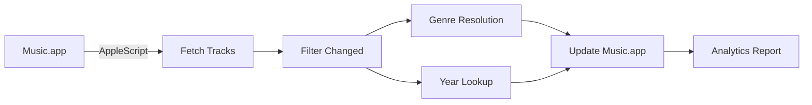
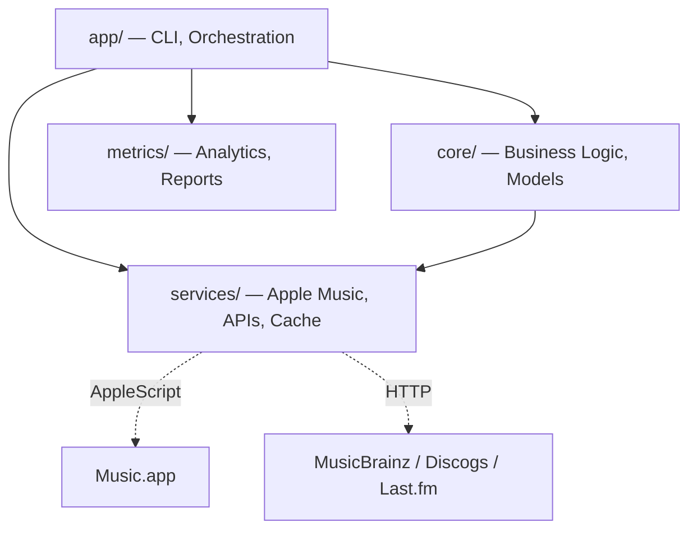

# Music Genre Updater


<p align="center">
  
  
  
  <a href="https://github.com/barad1tos/GenreUpdater/actions/workflows/ci.yml"></a>
  <a href="https://codecov.io/gh/barad1tos/GenreUpdater"></a>
  <a href="https://github.com/astral-sh/ruff"></a>
</p>

Automatically updates **genres** and **release years** for your Apple Music tracks.
Built for large libraries (30,000+ tracks) with async processing, multi-tier caching, and incremental delta updates.

## What It Does

- **Fixes messy genres** — determines the dominant genre from the earliest added album per artist
- **Fills in missing years** — queries MusicBrainz, Discogs, and Last.fm with confidence scoring
- **Cleans up metadata** — strips "Remastered," "Deluxe Edition," and other promotional text
- **Previews before changing** — `--dry-run` mode shows exactly what would change
- **Processes incrementally** — only touches tracks modified since the last run

## How It Works



Tracks flow through a pipeline: fetched from Music.app via AppleScript, filtered for changes, processed for genre/year
updates via external APIs, then written back. Every run generates an analytics HTML report.

## Features

| Category        | Details                                                                         |
|-----------------|---------------------------------------------------------------------------------|
| **Caching**     | Library snapshot (30K+ tracks in <1s), memory + disk + snapshot tiers           |
| **APIs**        | MusicBrainz, Discogs, Last.fm with confidence scoring and fallback              |
| **AppleScript** | 5 operations: fetch all, fetch by IDs, batch update, update property, fetch IDs |
| **Security**    | Fernet-encrypted API keys, input sanitization, key rotation                     |
| **Processing**  | Async/await, incremental delta updates, batch mode, dry-run                     |
| **Reporting**   | HTML analytics with color-coded function durations and call counts              |

## Quick Start

**Requirements:** macOS 10.15+, Python 3.13+, Apple Music app

```bash test="skip"
# Install
curl -LsSf https://astral.sh/uv/install.sh | sh
git clone https://github.com/barad1tos/GenreUpdater.git
cd GenreUpdater && uv sync

# Configure
cp config.yaml my-config.yaml
# Edit my-config.yaml with your paths

# Run
uv run python main.py --dry-run  # Preview first
uv run python main.py            # Apply changes
```

## CLI Reference

### Global Flags

| Flag            | Description                             |
|-----------------|-----------------------------------------|
| `--dry-run`     | Preview changes without applying        |
| `--force`       | Bypass incremental checks and cache     |
| `--fresh`       | Clear all caches before running         |
| `--test-mode`   | Process only `test_artists` from config |
| `--verbose`     | Enable debug logging                    |
| `--quiet`       | Suppress non-critical output            |
| `--config PATH` | Path to configuration file              |

### Commands

| Command                 | Alias         | Description                           |
|-------------------------|---------------|---------------------------------------|
| *(default)*             |               | Full update (genres + years)          |
| `update_genres`         | `genres`      | Update genres from external APIs      |
| `update_years`          | `years`       | Fetch missing release years           |
| `clean_artist`          | `clean`       | Remove promotional text from metadata |
| `revert_years`          | `revert`      | Revert year changes for an artist     |
| `restore_release_years` | `restore`     | Fix albums with wrong reissue years   |
| `verify_database`       | `verify-db`   | Verify tracks against Music.app       |
| `verify_pending`        | `pending`     | Retry failed year lookups             |
| `batch`                 |               | Process multiple artists from a file  |
| `rotate_keys`           | `rotate-keys` | Rotate API key encryption             |

See [CLI Guide](https://barad1tos.github.io/GenreUpdater/guide/cli/) for full usage and examples.

## Configuration

Edit `my-config.yaml` with your paths:

```yaml test="skip"
music_library_path: /Users/you/Music/Music/Music Library.musiclibrary
apple_scripts_dir: /path/to/GenreUpdater/applescripts
logs_base_dir: /path/to/logs
```

Config lookup order: `--config` flag > `my-config.yaml` > `config.yaml`

See [Configuration Reference](https://barad1tos.github.io/GenreUpdater/getting-started/configuration/) for all options
including API keys, caching, and performance tuning.

## Architecture



Four-layer clean architecture:

- **`app/`** — CLI argument parsing, command orchestration, feature modules
- **`core/`** — Business logic, Pydantic models, track processing, error handling
- **`services/`** — Apple Music (AppleScript), external APIs, multi-tier caching
- **`metrics/`** — Function-level analytics, performance tracking, HTML reports

See [Architecture Overview](https://barad1tos.github.io/GenreUpdater/architecture/overview/) for details.

## Tech Stack

| Technology      | Purpose                               |
|-----------------|---------------------------------------|
| Python 3.13     | Runtime (async/await, `datetime.UTC`) |
| Pydantic v2     | Data validation and settings          |
| aiohttp         | Async HTTP for API queries            |
| AppleScript     | Music.app integration (5 scripts)     |
| orjson          | Fast JSON serialization for cache     |
| cryptography    | Fernet encryption for API keys        |
| Rich            | Terminal output and progress bars     |
| Ruff            | Linting and formatting                |
| ty              | Type checking (Astral)                |
| MkDocs Material | Documentation site                    |
| pytest + xdist  | Parallel test execution               |

## Performance

| Metric                  | Value                                        |
|-------------------------|----------------------------------------------|
| Library snapshot load   | <1s for 30,000+ tracks                       |
| Incremental update      | Only changed tracks since last run           |
| Cache tiers             | Memory (hot) > Disk (warm) > Snapshot (cold) |
| API cache TTL           | 20 minutes (configurable)                    |
| AppleScript concurrency | 2 parallel operations (safe limit)           |

## Security

- **Encrypted API keys** — Fernet symmetric encryption via `cryptography`
- **Key rotation** — built-in `rotate_keys` command
- **Input sanitization** — all AppleScript inputs are sanitized
- **No shell=True** — subprocess calls use argument lists

## Development

```bash test="skip"
# Install dependencies
uv sync

# Run tests
uv run pytest

# Lint and format
uv run ruff check src/ --fix
uv run ruff format src/

# Type check
uv run ty check src/ --python .venv

# Build docs
uv run mkdocs serve

# All checks via pre-commit
prek run --all-files
```

## Documentation

Full documentation: **[barad1tos.github.io/GenreUpdater](https://barad1tos.github.io/GenreUpdater/)**

| Section                                                                                  | Topics                         |
|------------------------------------------------------------------------------------------|--------------------------------|
| [Installation](https://barad1tos.github.io/GenreUpdater/getting-started/installation/)   | Setup, dependencies, first run |
| [CLI Commands](https://barad1tos.github.io/GenreUpdater/guide/cli/)                      | All commands with examples     |
| [Configuration](https://barad1tos.github.io/GenreUpdater/getting-started/configuration/) | YAML options, API keys, tuning |
| [Automation](https://barad1tos.github.io/GenreUpdater/guide/automation/)                 | launchd, cron, scheduling      |
| [Architecture](https://barad1tos.github.io/GenreUpdater/architecture/overview/)          | Layers, data flow, caching     |
| [API Reference](https://barad1tos.github.io/GenreUpdater/reference/)                     | Auto-generated from docstrings |
| [FAQ](https://barad1tos.github.io/GenreUpdater/guide/faq/)                               | Common questions               |

## Project Structure

```bash
GenreUpdater/
├── src/
│   ├── app/              # CLI, orchestration, feature modules
│   │   └── features/     # Command implementations
│   ├── core/             # Business logic
│   │   ├── models/       # Pydantic models, protocols, validators
│   │   ├── tracks/       # Track processing, genre/year logic
│   │   └── utils/        # Date/time utilities
│   ├── services/         # External integrations
│   │   ├── api/          # MusicBrainz, Discogs, Last.fm clients
│   │   ├── apple/        # AppleScript client
│   │   └── cache/        # Multi-tier caching, hash service
│   └── metrics/          # Analytics, reports, monitoring
├── applescripts/         # 5 AppleScript files for Music.app
├── tests/                # Unit, integration, e2e tests
├── docs/                 # MkDocs documentation source
├── config.yaml           # Default configuration template
├── main.py               # Entry point
└── pyproject.toml        # Dependencies and tool config
```

## Contributing

Contributions are welcome! See [CONTRIBUTING.md](CONTRIBUTING.md) for guidelines, code style, and PR process.

```bash test="skip"
git clone https://github.com/barad1tos/GenreUpdater.git
cd GenreUpdater && uv sync
uv run pytest tests/unit/ -v --cov=src
uv run ruff check src/ tests/
```

## Links

- [Changelog](CHANGELOG.md)
- [Contributing](CONTRIBUTING.md)
- [Security Policy](SECURITY.md)
- [License](LICENSE) — MIT

## Contact

**Author:** Roman Borodavkin

- Email: [roman.borodavkin@gmail.com](mailto:roman.borodavkin@gmail.com)
- GitHub: [@barad1tos](https://github.com/barad1tos)

---

> **Warning:** Changes sync to iCloud immediately and cannot be easily reverted. Always use `--dry-run` first!
