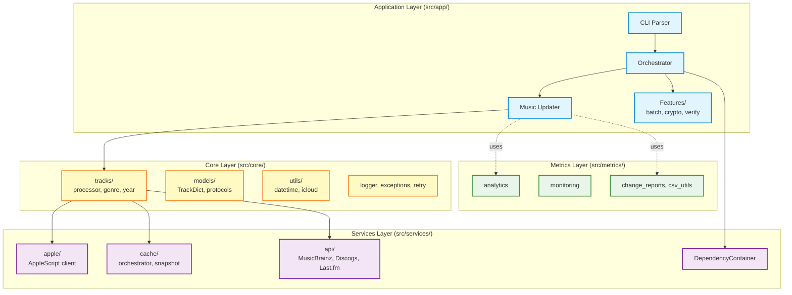

# Music Genre Updater


<p align="center">
  
  
  <a href="https://github.com/barad1tos/GenreUpdater/actions/workflows/ci.yml"></a>
  <a href="https://codecov.io/gh/barad1tos/GenreUpdater"></a>
  
</p>

**Music Genre Updater** is a Python-based tool that automatically updates genres and release years
for your Apple Music tracks. It analyzes your music library, determines the dominant genre for each artist,
and retrieves accurate release years from multiple music databases (MusicBrainz, Discogs, Last.fm).

## Table of Contents

- [Features](#features)
- [Architecture](#architecture)
- [Prerequisites](#prerequisites)
- [Installation](#installation)
- [Configuration](#configuration)
- [Usage](#usage)
- [Performance](#performance)
- [Logging](#logging)
- [AppleScript Integration](#applescript-integration)
- [Contributing](#contributing)
- [License](#license)
- [Troubleshooting](#troubleshooting)
- [FAQ](#faq)

## Features

### Core Functionality

- **Automatic Genre Updating** - Determines and updates the dominant genre for each artist based on track analysis
- **Automatic Year Updating** - Retrieves release years from multiple APIs with intelligent scoring
- **Batch Processing** - Efficiently handles large libraries (30,000+ tracks)
- **Contextual Logging** - Detailed logs with `artist | album | track` context
- **Smart Filtering** - Skips read-only tracks (prerelease, cloud status)

### Performance (v2.0)

- **Library Snapshot Caching** - Load 30K+ tracks in <1 second from disk
- **Incremental Delta Updates** - Process only changed tracks since last run
- **Multi-Tier Caching** - Memory → Disk → Snapshot for optimal speed
- **Async/Await Architecture** - All I/O operations are async

### Security (v2.0)

- **Encrypted Configuration** - Secure storage for API keys using cryptography
- **Key Rotation** - Built-in command to rotate encryption keys
- **Database Verification** - Integrity checks for track database
- **Input Validation** - Security validators for all user-provided data

## Architecture

Music Genre Updater v2.0 follows a **clean architecture pattern** with four layers:



### Key Design Patterns

- **Dependency Injection** - `DependencyContainer` manages all service instances
- **Protocol-Based Interfaces** - Enables testing and mocking
- **Multi-Tier Caching** - Memory → Disk → Snapshot
- **Contextual Logging** - Every log includes `artist | album | track` context

## Prerequisites

- **macOS** 10.15 (Catalina) or higher
- **Python** 3.13+
- **Apple Music** installed and running
- **uv** (recommended) or pip for package management

## Installation

### Method 1: Using uv (Recommended)

[uv](https://github.com/astral-sh/uv) is a modern, fast Python package manager.

```bash
# Install uv
curl -LsSf https://astral.sh/uv/install.sh | sh

# Clone the repository
git clone https://github.com/barad1tos/GenreUpdater.git
cd GenreUpdater

# Install dependencies
uv sync

# Verify installation
uv run python main.py --help
```

### Method 2: Traditional pip/venv

```bash
# Clone the repository
git clone https://github.com/barad1tos/GenreUpdater.git
cd GenreUpdater

# Create virtual environment
python3.13 -m venv .venv
source .venv/bin/activate

# Install dependencies
pip install -e .

# Verify installation
python main.py --help
```

## Configuration

Copy and customize the configuration file:

```bash
cp config.yaml my-config.yaml
```

### Key Configuration Sections

```yaml
# Core Paths
music_library_path: /Users/username/Music/Music/Music Library.musiclibrary
apple_scripts_dir: /path/to/applescripts
logs_base_dir: /path/to/logs

# AppleScript Settings
apple_script_concurrency: 2
applescript_timeouts:
  single_artist_fetch: 600   # 10 minutes
  full_library_fetch: 3600   # 1 hour
  batch_update: 60           # 1 minute

# Batch Processing
batch_processing:
  ids_batch_size: 200
  enabled: true

# Library Snapshot
library_snapshot:
  enabled: true
  snapshot_dir: cache/snapshots
  delta_enabled: true

# Analytics
analytics:
  duration_thresholds:
    short_max: 2   # green
    medium_max: 5  # gray
    long_max: 10   # pink
```

### Automation with launchctl

Create `~/Library/LaunchAgents/com.barad1tos.MusicGenreUpdater.plist`:

```xml
<?xml version="1.0" encoding="UTF-8"?>
<!DOCTYPE plist PUBLIC "-//Apple//DTD PLIST 1.0//EN" "http://www.apple.com/DTDs/PropertyList-1.0.dtd">
<plist version="1.0">
<dict>
    <key>Label</key>
    <string>com.barad1tos.MusicGenreUpdater</string>
    <key>ProgramArguments</key>
    <array>
        <string>/path/to/.venv/bin/python</string>
        <string>/path/to/GenreUpdater/main.py</string>
    </array>
    <key>StartInterval</key>
    <integer>1800</integer>
    <key>WorkingDirectory</key>
    <string>/path/to/GenreUpdater</string>
</dict>
</plist>
```

Load the agent:

```bash
launchctl load ~/Library/LaunchAgents/com.barad1tos.MusicGenreUpdater.plist
```

## Usage

### Global Flags

| Flag | Description |
|------|-------------|
| `--force` | Bypass incremental checks and cache |
| `--dry-run` | Preview changes without applying |
| `--test-mode` | Run only on test_artists from config |
| `--verbose`, `-v` | Enable verbose logging |
| `--quiet`, `-q` | Suppress non-critical output |
| `--config PATH` | Use custom config file |

### Commands

| Command | Aliases | Description |
|---------|---------|-------------|
| _(default)_ | - | Full library genre and year update |
| `clean_artist` | `clean` | Clean metadata for specific artist |
| `update_years` | `years` | Fetch release years from APIs |
| `revert_years` | `revert` | Rollback year changes |
| `verify_database` | `verify-db` | Verify track database integrity |
| `verify_pending` | `pending` | Check pending verification queue |
| `batch` | - | Batch processing from file |
| `rotate_keys` | `rotate-keys` | Rotate encryption keys |

### Examples

```bash
# Full library update
uv run python main.py

# Dry run (preview only)
uv run python main.py --dry-run

# Force update (bypass cache)
uv run python main.py --force

# Clean artist metadata
uv run python main.py clean_artist --artist "Pink Floyd"

# Update years for specific artist
uv run python main.py update_years --artist "Otep"

# Revert year changes
uv run python main.py revert_years --artist "Otep" --album "The God Slayer"

# Batch processing from file
uv run python main.py batch --file artists.txt --operation full

# Database verification
uv run python main.py verify_database

# Rotate encryption keys
uv run python main.py rotate_keys
```

## Performance

### Caching Strategy

| Tier | Type | Latency | Persistence |
|------|------|---------|-------------|
| L1 | Memory | <1ms | Session only |
| L2 | Disk (JSON) | 10-50ms | 20min TTL |
| L3 | Snapshot | <1s for 30K tracks | Permanent |

### Batch Processing

For libraries with 30K+ tracks:

```bash
uv run python main.py batch --file artists.txt --operation full
```

Features:
- Processes artists from file (one per line)
- Automatic parse failure tolerance (max 3 consecutive)
- Memory-efficient streaming
- Progress logging after each artist

## Logging

Three specialized loggers:

1. **Console Logger** - Real-time feedback (INFO+)
2. **Error Logger** - Detailed error information
3. **Analytics Logger** - Function timing and call counts

### Log Files

- Main log: `<logs_base_dir>/main/main.log`
- Year changes: `<logs_base_dir>/main/year_changes.log`
- CSV reports: `<logs_base_dir>/csv/changes_report.csv`
- Analytics: `<logs_base_dir>/analytics/reports/analytics.html`

## AppleScript Integration

The application uses AppleScript files in the `applescripts/` directory:

| Script | Purpose |
|--------|---------|
| `fetch_tracks.scpt` | Fetch all tracks from Music.app |
| `fetch_tracks_by_ids.scpt` | Fetch specific tracks by ID list |
| `update_property.applescript` | Update single track property |
| `batch_update_tracks.applescript` | Batch updates (experimental) |
| `fetch_track_ids.applescript` | Fetch track IDs only |

**Output Format**: ASCII-separated fields (field: `\x1E`, line: `\x1D`)

The `AppleScriptClient` (`src/services/apple/`) handles script execution with proper
error handling, timeouts, and retry logic.

## Contributing

See [CONTRIBUTING.md](CONTRIBUTING.md) for development guidelines.

Quick start:

```bash
# Fork and clone
git clone https://github.com/yourusername/GenreUpdater.git
cd GenreUpdater

# Create branch
git checkout -b feature/your-feature

# Install dev dependencies
uv sync

# Run tests
uv run pytest

# Run linters
uv run ruff check src/
uv run mypy src/
```

## License

MIT License - see [LICENSE](LICENSE) for details.

## Contacts

- **Author**: Roman Borodavkin
- **Email**: [roman.borodavkin@gmail.com](mailto:roman.borodavkin@gmail.com)
- **GitHub**: [@barad1tos](https://github.com/barad1tos)

## Changelog

See [CHANGELOG.md](CHANGELOG.md) for version history.

## Troubleshooting

### Common Issues

**"Music app is not running"**
- Launch Music.app before running (except `rotate_keys` command)

**AppleScript timeout**
- Increase timeout in `config.yaml` under `applescript_timeouts`

**Cache corruption**
- Delete `cache/` directory and re-run

**Parse failures during batch**
- Reduce `batch_processing.ids_batch_size` in config

### Verification

```bash
# Check Python version
python3 --version  # Should be 3.13+

# Test AppleScript manually
osascript applescripts/fetch_tracks.scpt

# Check launch agent status
launchctl list | grep com.barad1tos.MusicGenreUpdater
```

## FAQ

**Q: How do I adjust update frequency?**

Modify `StartInterval` in the plist file (seconds) and `incremental_interval_minutes` in config.yaml.

**Q: How do I add exceptions for artists/albums?**

```yaml
exceptions:
  track_cleaning:
    - artist: "Artist Name"
      album: "Album Name"
```

**Q: What happens if updates fail?**

The script retries based on `max_retries` and `retry_delay_seconds` settings.
Failed updates are logged and the track remains unchanged.

**Q: How can I see changes made?**

Check `<logs_base_dir>/csv/changes_report.csv` for all modifications.

**Q: Can I run multiple instances?**

Not recommended. Use a single instance to avoid race conditions.

**Q: How do I customize cleaning keywords?**

```yaml
cleaning:
  remaster_keywords:
    - remaster
    - remastered
    - deluxe
  album_suffixes_to_remove:
    - " - EP"
    - " - Single"
```

---

**Disclaimer**: Always ensure you understand how the scripts operate before use.
Changes sync to iCloud immediately and cannot be easily reverted.
