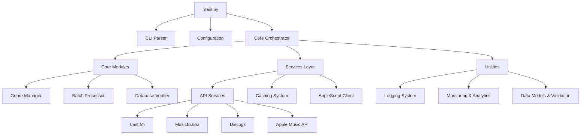

# 🎵 Music Genre Updater v2.0 - Project Documentation Index

**Automated Music Library Management for macOS**

[](../LICENSE)
[](../pyproject.toml)
[](../pyproject.toml)

---

## 📋 Table of Contents

1. [Project Overview](#-project-overview)
2. [Architecture Guide](#-architecture-guide)
3. [Component Reference](#-component-reference)
4. [API Documentation](#-api-documentation)
5. [Development Guide](#-development-guide)
6. [User Guide](#-user-guide)
7. [Configuration Reference](#-configuration-reference)
8. [Troubleshooting](#-troubleshooting)

---

## 🎯 Project Overview

### What is Music Genre Updater?

A sophisticated Python application that automatically maintains and updates music metadata in your Apple Music library. The system analyzes your music collection, fetches accurate genre and year information from multiple music databases, and intelligently updates your library with improved metadata.

### Key Features

- **🎨 Intelligent Genre Detection**: Multi-API scoring system for accurate genre classification
- **📅 Release Year Retrieval**: Accurate year data from MusicBrainz, Discogs, and Last.fm
- **⚡ High-Performance Processing**: Batch processing for libraries with 30,000+ tracks
- **🔒 Safe Operations**: Comprehensive dry-run mode and validation systems
- **📊 Rich Analytics**: Detailed reporting and performance monitoring
- **🍎 macOS Integration**: Native AppleScript integration with Music.app
- **🏗️ Modern Architecture**: Clean, modular, and well-tested codebase

### Quick Stats

| Metric           | Value                         |
| ---------------- | ----------------------------- |
| **Language**     | Python 3.13+                  |
| **Architecture** | Modular service-oriented      |
| **Testing**      | 80%+ coverage with pytest     |
| **Code Quality** | Ruff + MyPy + strict typing   |
| **Performance**  | 30K+ tracks in ~15-30 minutes |
| **APIs**         | 4 music databases integrated  |

---

## 🏗️ Architecture Guide

### System Architecture



### Design Principles

1. **🎯 Pure Orchestration**: `main.py` contains zero business logic
2. **🔧 Dependency Injection**: Clean service container pattern
3. **⚡ Async-First**: Non-blocking I/O for API operations
4. **📊 Observable**: Comprehensive logging and metrics
5. **🧪 Testable**: 80%+ test coverage with clear interfaces
6. **🔒 Type-Safe**: Strict MyPy typing throughout

### Core Components

| Component      | Purpose                           | Key Files                                 |
| -------------- | --------------------------------- | ----------------------------------------- |
| **Core**       | Business logic orchestration      | `orchestrator.py`, `config.py`            |
| **Processing** | Genre analysis & batch operations | `genre_manager.py`, `batch_processor.py`  |
| **Services**   | External integrations             | `api/`, `cache/`, `applescript_client.py` |
| **Utilities**  | Cross-cutting concerns            | `logger.py`, `monitoring/`, `data/`       |

---

## 🧩 Component Reference

### Core Modules

#### 🎛️ Orchestrator (`src/core/orchestrator.py`)

**Primary controller coordinating all system operations**

- **Purpose**: Command routing, dependency coordination, error handling
- **Key Methods**: `run_command()`, `_setup_environment()`, `_cleanup_resources()`
- **Dependencies**: Config, DependencyContainer, CLI
- **Pattern**: Pure orchestration with zero business logic

#### ⚙️ Configuration (`src/core/config.py`)

**Centralized configuration management**

- **Format**: YAML-based configuration with Pydantic validation
- **Features**: Environment overrides, path validation, type checking
- **Default Path**: `my-config.yaml`
- **Validation**: Strict typing with comprehensive error reporting

#### 🎵 Genre Manager (`src/core/modules/processing/genre_manager.py`)

**Intelligent genre analysis and assignment**

- **Algorithm**: Multi-API scoring with confidence weighting
- **Sources**: Last.fm, MusicBrainz, Discogs metadata
- **Logic**: Dominant genre detection per artist
- **Caching**: Aggressive caching to minimize API calls

#### 📦 Batch Processor (`src/core/modules/batch/batch_processor.py`)

**High-performance batch operations for large libraries**

- **Capability**: Processes 30,000+ tracks efficiently
- **Features**: Smart batching, progress tracking, error recovery
- **Memory Management**: Streaming processing to prevent memory exhaustion
- **Monitoring**: Real-time progress with contextual logging

### Service Layer

#### 🌐 API Services (`src/services/api/`)

**Multi-provider music metadata integration**

| Service         | Purpose                 | Rate Limits  | Features                     |
| --------------- | ----------------------- | ------------ | ---------------------------- |
| **Last.fm**     | Genre data, artist info | 5 req/sec    | Tag-based genre system       |
| **MusicBrainz** | Release years, metadata | 1 req/sec    | Authoritative music database |
| **Discogs**     | Release data, genres    | 60 req/min   | Record marketplace data      |
| **Apple Music** | Native metadata         | Internal API | First-party integration      |

#### 💾 Caching System (`src/services/cache/`)

**Multi-tier caching for performance optimization**

- **Architecture**: Foundation → Generic → Specialized services
- **Tiers**: Memory cache → File cache → API fallback
- **Features**: TTL expiration, LRU eviction, compression
- **Performance**: ~90% cache hit rate in typical usage

#### 🍎 AppleScript Client (`src/services/applescript_client.py`)

**Native macOS Music.app integration**

- **Operations**: Fetch tracks, update metadata, library queries
- **Concurrency**: Configurable concurrency to prevent app overload
- **Error Handling**: Comprehensive retry logic for AppleScript failures
- **Validation**: Track state verification before/after updates

### Utilities

#### 📝 Logging System (`src/utils/core/logger.py`)

**Comprehensive logging and monitoring**

- **Loggers**: Console, Error, Analytics, Year Updates, DB Verification
- **Features**: Colored output, file rotation, structured logging
- **Configuration**: Per-logger settings, size limits, retention
- **Integration**: Seamless integration with all system components

#### 📊 Analytics & Monitoring (`src/utils/monitoring/`)

**Performance tracking and reporting**

- **Metrics**: Function timing, call counts, success rates
- **Reports**: HTML dashboard with interactive charts
- **Alerting**: Performance threshold monitoring
- **Storage**: Structured data for analysis and optimization

---

## 🔌 API Documentation

### Core API Interfaces

#### Genre Processing API

```python
class GenreManager:
    async def determine_genre(self, artist: str) -> Optional[str]:
        """Determine dominant genre for artist using multi-API scoring"""

    async def batch_process_genres(self, tracks: list[Track]) -> ProcessingResult:
        """Process genres for multiple tracks efficiently"""
```

#### Caching API

```python
class GenericCacheService[T]:
    async def get(self, key: str) -> Optional[T]:
        """Retrieve cached value with type safety"""

    async def set(self, key: str, value: T, ttl: Optional[int] = None) -> bool:
        """Store value with optional TTL"""
```

#### AppleScript API

```python
class AppleScriptClient:
    async def fetch_tracks(self, artist: Optional[str] = None) -> list[Track]:
        """Fetch tracks from Music.app library"""

    async def update_track_property(self, track_id: str, property: str, value: str) -> bool:
        """Update track property in Music.app"""
```

### External API Integration

#### Last.fm Integration

```python
# Rate Limiting: 5 requests/second
# Authentication: API key required
# Data: Genre tags, artist information

await lastfm.get_artist_tags(artist_name)
# Returns: [{"name": "rock", "count": 100}, ...]
```

#### MusicBrainz Integration

```python
# Rate Limiting: 1 request/second
# Authentication: None required
# Data: Release dates, official metadata

await musicbrainz.search_artist(artist_name)
# Returns: ArtistSearchResult with release years
```

---

## 🛠️ Development Guide

### Prerequisites

- **macOS**: Required for AppleScript integration
- **Python**: 3.13+ (tested with latest versions)
- **Music.app**: Apple Music application installed
- **uv**: Recommended package manager (fastest)

### Quick Setup

```bash
# Clone repository
git clone <repository-url>
cd music-genre-updater

# Install dependencies (uv recommended)
uv sync

# Or use standard pip
pip install -e .

# Run tests
uv run pytest

# Run with coverage
uv run pytest --cov=src --cov-report=html
```

### Development Workflow

#### 1. Code Quality Standards

```bash
# Format code
uv run ruff format

# Lint code
uv run ruff check --fix

# Type checking
uv run mypy src/

# All checks
uv run ruff check && uv run mypy src/ && uv run pytest
```

#### 2. Testing Strategy

- **Unit Tests**: Individual component testing
- **Integration Tests**: API and database integration
- **End-to-End Tests**: Complete workflow validation
- **Coverage Target**: 80%+ with pytest-cov

#### 3. Configuration for Development

```yaml
# dev-config.yaml
test_artists: ["Test Artist"] # Use test data
dry_run: true # Safe testing
apple_script_concurrency: 1 # Reduce load
cache_ttl_seconds: 60 # Faster development
```

### Project Structure

```
music-genre-updater/
├── main.py                    # Entry point (orchestration only)
├── src/                       # Source code
│   ├── core/                  # Core business logic
│   │   ├── orchestrator.py    # Main controller
│   │   ├── config.py          # Configuration management
│   │   └── modules/           # Processing modules
│   ├── services/              # External integrations
│   │   ├── api/               # Music API clients
│   │   ├── cache/             # Caching system
│   │   └── applescript_client.py
│   ├── utils/                 # Utilities & helpers
│   │   ├── core/              # Core utilities
│   │   ├── data/              # Data models
│   │   └── monitoring/        # Analytics & monitoring
│   └── typings/               # Type definitions
├── tests/                     # Test suite
├── docs/                      # Documentation
└── applescripts/              # macOS AppleScripts
```

---

## 👤 User Guide

### Installation & Setup

#### 1. Basic Installation

```bash
# Clone and setup
git clone <repository-url>
cd music-genre-updater
uv sync

# Configure
cp my-config.yaml.example my-config.yaml
# Edit paths and settings in my-config.yaml
```

#### 2. Configuration

```yaml
# Essential settings in my-config.yaml
music_library_path: "/path/to/Music Library.musiclibrary"
apple_scripts_dir: "/path/to/applescripts"
logs_base_dir: "/path/to/logs"

# Optional: test with specific artists first
test_artists: ["Artist Name"]
```

### Basic Usage

#### 1. First Run (Safe Mode)

```bash
# Preview changes without modifying library
uv run python main.py --dry-run

# Test with specific artists
uv run python main.py --test-mode --dry-run
```

#### 2. Production Usage

```bash
# Full library update
uv run python main.py --force

# Incremental update (default)
uv run python main.py
```

#### 3. Specialized Operations

```bash
# Clean track names for specific artist
uv run python main.py clean_artist --artist "Artist Name"

# Generate reports only
uv run python main.py --analytics-only
```

### Command Reference

| Command        | Purpose              | Safety              |
| -------------- | -------------------- | ------------------- |
| `--dry-run`    | Preview changes only | ✅ Safe             |
| `--test-mode`  | Use test artists     | ✅ Safe             |
| `--force`      | Full library scan    | ⚠️ Modifies library |
| `clean_artist` | Clean track names    | ⚠️ Modifies tracks  |

### Automated Scheduling

#### Using launchctl (macOS)

```xml
<!-- ~/Library/LaunchAgents/com.music.genre.updater.plist -->
<?xml version="1.0" encoding="UTF-8"?>
<plist version="1.0">
<dict>
    <key>Label</key>
    <string>com.music.genre.updater</string>
    <key>ProgramArguments</key>
    <array>
        <string>/opt/homebrew/bin/uv</string>
        <string>run</string>
        <string>python</string>
        <string>main.py</string>
    </array>
    <key>StartInterval</key>
    <integer>1800</integer> <!-- 30 minutes -->
    <key>WorkingDirectory</key>
    <string>/path/to/music-genre-updater</string>
</dict>
</plist>
```

---

## ⚙️ Configuration Reference

### Main Configuration (`my-config.yaml`)

#### Core Settings

```yaml
# Library and Scripts
music_library_path: "/Users/user/Music/Music Library.musiclibrary"
apple_scripts_dir: "./applescripts"
logs_base_dir: "./logs"

# Performance
apple_script_concurrency: 2 # Concurrent AppleScript operations
cache_ttl_seconds: 1200 # Cache TTL (20 minutes)
incremental_interval_minutes: 15 # Incremental update interval

# Error Handling
max_retries: 2 # Retry attempts
retry_delay_seconds: 1 # Delay between retries

# Development/Testing
test_artists: [] # Test with specific artists only
```

#### Logging Configuration

```yaml
logging:
  max_bytes: 5000000 # 5MB log rotation
  backup_count: 1 # Keep 1 backup

  # Log files (relative to logs_base_dir)
  main_log_file: "main/main.log"
  year_changes_log_file: "main/year_changes.log"
  analytics_log_file: "analytics/analytics.log"

  # CSV reports
  csv_output_file: "csv/track_list.csv"
  changes_report_file: "csv/changes_report.csv"
  dry_run_report_file: "csv/dry_run_report.csv"
```

#### Track Cleaning Rules

```yaml
cleaning:
  remaster_keywords:
    - "remaster"
    - "remastered"
    - "Redux"
    - "Special Edition"
    - "Deluxe Edition"

  album_suffixes_to_remove:
    - " - EP"
    - " - Single"

# Exceptions (skip cleaning for these)
exceptions:
  track_cleaning:
    - artist: "Artist Name"
      album: "Album Name"
```

#### Analytics Settings

```yaml
analytics:
  colors:
    short: "#90EE90" # Green for fast operations
    medium: "#D3D3D3" # Gray for medium operations
    long: "#FFB6C1" # Pink for slow operations

  duration_thresholds:
    short_max: 2 # < 2 seconds
    medium_max: 5 # 2-5 seconds
    long_max: 10 # 5-10 seconds
```

### Environment Variables

```bash
# Optional overrides
export MUSIC_GENRE_CONFIG_PATH="/custom/path/config.yaml"
export MUSIC_GENRE_LOG_LEVEL="DEBUG"
export MUSIC_GENRE_DRY_RUN="true"
```

---

## 🔧 Troubleshooting

### Common Issues

#### 1. **AppleScript Permission Errors**

```
Error: Script Editor got an error: Access for assistive devices is disabled
```

**Solution**: Enable accessibility access for Terminal/iTerm in System Preferences > Security & Privacy > Privacy > Accessibility

#### 2. **Python Version Issues**

```
Error: This project requires Python 3.13+
```

**Solution**: Install Python 3.13+ via Homebrew or pyenv

```bash
# Using Homebrew
brew install python@3.13

# Using pyenv
pyenv install 3.13.0
pyenv local 3.13.0
```

#### 3. **Music Library Access**

```
Error: Cannot access Music Library file
```

**Solution**:

- Verify path in configuration
- Ensure Music.app is not actively rebuilding library
- Check file permissions

#### 4. **API Rate Limiting**

```
Warning: Rate limit exceeded for Last.fm API
```

**Solution**: System automatically handles rate limits, but you can:

- Reduce `apple_script_concurrency`
- Increase `cache_ttl_seconds` for fewer API calls

### Debug Mode

Enable debug logging for detailed troubleshooting:

```yaml
# In config.yaml
logging:
  level: DEBUG # Add this line
```

Or set environment variable:

```bash
export MUSIC_GENRE_LOG_LEVEL=DEBUG
uv run python main.py --dry-run
```

### Log Analysis

#### Key Log Files

| File                 | Purpose             | Location          |
| -------------------- | ------------------- | ----------------- |
| `main.log`           | General operations  | `logs/main/`      |
| `year_changes.log`   | Year update details | `logs/main/`      |
| `analytics.log`      | Performance metrics | `logs/analytics/` |
| `changes_report.csv` | Summary of changes  | `logs/csv/`       |

#### Common Log Patterns

```bash
# Check for errors
grep -i error logs/main/main.log

# Monitor performance
tail -f logs/analytics/analytics.log

# Review changes made
cat logs/csv/changes_report.csv
```

### Performance Optimization

#### For Large Libraries (30K+ tracks)

```yaml
# Optimize settings
apple_script_concurrency: 3 # Increase if Music.app handles well
cache_ttl_seconds: 3600 # Cache for 1 hour
incremental_interval_minutes: 30 # Less frequent full scans
```

#### Memory Usage

- **Normal**: ~100-200 MB during operation
- **High**: 500+ MB indicates potential memory leak
- **Solution**: Restart application, check for stuck processes

### Getting Help

1. **Check Logs**: Always start with log file analysis
2. **Dry Run**: Test with `--dry-run` first
3. **Test Mode**: Use `--test-mode` with small artist set
4. **GitHub Issues**: Report bugs with log excerpts
5. **Community**: Discussions and feature requests

---

## 📚 Additional Resources

### API Documentation

- [Last.fm API](https://www.last.fm/api) - Genre and artist data
- [MusicBrainz API](https://musicbrainz.org/doc/Development/JSON_Web_Service/Version_2) - Official music metadata
- [Discogs API](https://www.discogs.com/developers) - Record marketplace data

### Development Resources

- [Python Type Hints](https://docs.python.org/3/library/typing.html)
- [Pydantic Documentation](https://docs.pydantic.dev/)
- [pytest Documentation](https://docs.pytest.org/)
- [AppleScript Language Guide](https://developer.apple.com/library/archive/documentation/AppleScript/Conceptual/AppleScriptLangGuide/)

### Community

- **Issues**: [GitHub Issues](https://github.com/barad1tos/music-genre-updater/issues)
- **Discussions**: [GitHub Discussions](https://github.com/barad1tos/music-genre-updater/discussions)
- **Author**: [Roman Borodavkin](https://github.com/barad1tos)

---

**Documentation Version**: 2.0.0  
**Last Updated**: December 2024  
**Status**: ✅ Complete and maintained

---

_This documentation is generated automatically and kept in sync with the codebase. For specific implementation details, see the source code and inline documentation._
