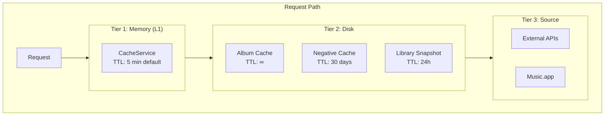

# Caching Architecture

Multi-tier caching system for performance optimization with 30,000+ track libraries.

## Overview



## Cache Types

### 1. Library Snapshot Cache

Stores the full track library to avoid repeated AppleScript calls.

```yaml
caching:
  library_snapshot:
    enabled: true
    delta_enabled: true
    cache_file: cache/library_snapshot.json
    max_age_hours: 24
    compress: true
    compress_level: 6
```

**Benefits**:

- First run: 30K tracks → ~45 seconds
- Subsequent runs: < 1 second (from snapshot)

**Delta Mode**:
When `delta_enabled: true`, only fetches tracks modified since snapshot creation.

### 2. Album Year Cache

Persistent cache for album release years (essentially permanent).

```yaml
album_years_cache_file: cache/album_years.csv
year_retrieval:
  processing:
    cache_ttl_days: 36500  # 100 years
```

**Format** (CSV):

```csv
artist,album,year,source,confidence,timestamp
Pink Floyd,The Wall,1979,musicbrainz,95,2024-01-15T10:30:00
```

### 3. Negative Result Cache

Remembers "album not found" to avoid repeated API calls.

```yaml
caching:
  negative_result_ttl: 2592000  # 30 days
```

**Why 30 days?**

- Albums in external DBs rarely appear suddenly
- Prevents hammering APIs for unknown albums
- Still allows retry after reasonable period

### 4. In-Memory Cache

Hot data cache for current session. Default TTL is 5 minutes, configurable via `cache_ttl_seconds`.

```yaml
cache_ttl_seconds: 1800  # Override default 5 min to 30 min for long sessions
```

!!! tip "Adjusting Cache TTL"
    The default 5-minute in-memory TTL works for most sessions. For large libraries
    (30K+ tracks) that take 30+ minutes to process, increase `cache_ttl_seconds`
    in your config.yaml to prevent mid-session cache expiration.

## Cache Key Generation

All caches use consistent key generation:

```python test="skip"
from services.cache.hash_service import UnifiedHashService

key = UnifiedHashService.generate_key(
    artist="Pink Floyd",
    album="The Wall"
)
# Returns: "pink_floyd__the_wall"
```

**Normalization**:

- Lowercase
- Whitespace → underscore
- Special chars removed
- Consistent across all cache layers

## Cache Invalidation

### Automatic

| Trigger        | Cache Affected         |
|----------------|------------------------|
| TTL expiry     | Memory cache           |
| Track modified | Library snapshot delta |
| Force flag     | All caches bypassed    |

### Manual

```bash
# Clear all caches
uv run python main.py --fresh

# Clear specific cache
rm -rf cache/library_snapshot.json
```

## Configuration Reference

```yaml
caching:
  # In-memory cache
  default_ttl_seconds: 900           # 15 minutes

  # Album cache sync
  album_cache_sync_interval: 300     # Sync to disk every 5 min

  # Background cleanup
  cleanup_interval_seconds: 300      # GC every 5 min
  cleanup_error_retry_delay: 60      # Retry after error

  # Negative results
  negative_result_ttl: 2592000       # 30 days

  # Library snapshot
  library_snapshot:
    enabled: true
    delta_enabled: true
    cache_file: cache/library_snapshot.json
    max_age_hours: 24
    compress: true
    compress_level: 6
```

## Performance Impact

### Without Caching

| Operation             | Time    |
|-----------------------|---------|
| Fetch 30K tracks      | ~45s    |
| Query APIs per album  | ~2s     |
| Total for 1000 albums | ~35 min |

### With Caching

| Operation               | Time  |
|-------------------------|-------|
| Load snapshot           | < 1s  |
| Cache hit (year)        | < 1ms |
| Incremental (10 tracks) | ~5s   |

## File Locations

```
cache/
├── library_snapshot.json      # Compressed track data
├── album_years.csv           # Year cache
└── cache.json                # API response cache
```

## Troubleshooting

### Stale Data

**Symptom**: Changes in Music.app not reflected.

**Solution**:

```bash
uv run python main.py --fresh
```

### Cache Corruption

**Symptom**: Parse errors on startup.

**Solution**:

```bash
rm -rf cache/
uv run python main.py
```

### Memory Growth

**Symptom**: High RAM usage over time.

**Solution**: Reduce in-memory TTL:

```yaml
cache_ttl_seconds: 300  # 5 minutes
```

## Implementation Details

### Snapshot Compression

Library snapshots use gzip compression:

```python test="skip"
import gzip
import json

# Write
with gzip.open(path, 'wt', compresslevel=6) as f:
    json.dump(data, f)

# Read
with gzip.open(path, 'rt') as f:
    data = json.load(f)
```

**Compression ratio**: ~10:1 for track data

### Thread Safety

Disk caches use file locking:

```python test="skip"
import fcntl

with open(cache_file, 'r+') as f:
    fcntl.flock(f, fcntl.LOCK_EX)
    # ... read/write ...
    fcntl.flock(f, fcntl.LOCK_UN)
```
