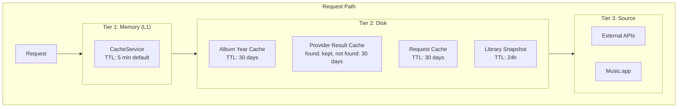

# Caching Architecture

Multi-tier caching system for performance optimization with 30,000+ track libraries.

## Overview


```mermaid
flowchart TB
    subgraph "Request Path"
        R[Request] --> L1
        L1 --> L2
        L2 --> L3
    end

    subgraph L1["Tier 1: Memory (L1)"]
        MC[CacheService<br/>TTL: 5 min default]
    end

subgraph L2["Tier 2: Disk"]
AC[Album Year Cache<br/>TTL: 30 days]
PC[Provider Result Cache<br/>found: kept, not found: 30 days]
RC[Request Cache<br/>TTL: 30 days]
LS[Library Snapshot<br/>TTL: 24h]
end

subgraph L3["Tier 3: Source"]
API[External APIs]
Music[Music.app]
end
```

## Cache Types

### 1. Library Snapshot Cache

Stores the full track library to avoid repeated AppleScript calls.

```yaml
caching:
  library_snapshot:
    enabled: true
    delta_enabled: true
    cache_file: cache/library_snapshot.json
    max_age_hours: 24
    compress: true
    compress_level: 6
```

**Benefits**:

- First run: 30K tracks → ~45 seconds
- Subsequent runs: < 1 second (from snapshot)

**Delta Mode**:
When `delta_enabled: true`, only fetches tracks modified since snapshot creation.

### 2. Album Year Cache

The year determined for each album, with the confidence it was determined at. A cached year is used without asking the providers only when its confidence is at least 90; entries expire after 30 days.

```yaml
album_years_cache_file: cache/album_years.csv
```

**Format** (CSV):

```csv
artist,album,year,source,confidence,timestamp
Pink Floyd,The Wall,1979,musicbrainz,95,2024-01-15T10:30:00
```

### 3. Provider Result Cache

What each provider (MusicBrainz, Discogs, iTunes) answered for an album: its release records, before scoring. The year search reads this cache first and asks the provider only on a miss. All three providers store their records in one shape (`ReleaseRecord` in `core/models/release_record.py`); an entry whose records lack its fields was written by an older version, so loading drops it and the next search asks the provider again.

| Answer                          | Kept                                |
|---------------------------------|-------------------------------------|
| Releases found                  | For good                            |
| Nothing found                   | `negative_result_ttl` (30 days)     |
| Request failed or token refused | Not cached; the next run asks again |

The records are scored when they are read, with the current search's artist region and activity period, so a cached answer never carries another search's context. Writing a year or a genre to a track leaves these entries alone, since it does not change what the providers answered. Removing a track, or renaming its artist or album, drops the album's entries for all three providers. The entries are found under the names the search used, which can differ from the library's: the search rewrites names before it asks (`&` becomes `and`, `w/` becomes `with`, a colon becomes a space, a trailing `+ 4` and anything after ` / ` are dropped, and quotes and parenthetical editions such as `(Remastered)` are removed from album titles), and the alternative search asks under other names again (a soundtrack by its title, Various Artists by the album alone). `--fresh` clears this cache along with the others.

```yaml
caching:
  negative_result_ttl: 2592000  # 30 days
```

**Why 30 days for "nothing found"?**

- Albums in external DBs rarely appear suddenly
- Prevents hammering APIs for unknown albums
- Still allows retry after reasonable period

### 4. Request Cache

Each provider response by URL and query, so repeated requests within and across runs are answered locally (for example, pressings of one Discogs album share their master). Responses are kept for `negative_result_ttl`; a 404 and a failed request are not cached. It lives in the generic cache file. Responses cached before this TTL applied carried an expiry around 2126; loading the generic cache drops any entry due to outlive the longest TTL a writer sets (one year), so those go on the first run.

### 5. In-Memory Cache

Hot data cache for current session. Default TTL is 5 minutes, configurable via `cache_ttl_seconds`.

```yaml
cache_ttl_seconds: 1800  # Override default 5 min to 30 min for long sessions
```

!!! tip "Adjusting Cache TTL"
    The default 5-minute in-memory TTL works for most sessions. For large libraries
    (30K+ tracks) that take 30+ minutes to process, increase `cache_ttl_seconds`
    in your config.yaml to prevent mid-session cache expiration.

## Cache Key Generation

Cache keys are SHA-256 hashes of the names after `normalize_for_matching` (trimmed and lowercased), so an album matches whatever its case or spacing:

```python test="skip"
"""Cache keys for one album."""

from services.cache.hash_service import UnifiedHashService

UnifiedHashService.hash_album_key("Pink Floyd", "The Wall")  # album year cache
UnifiedHashService.hash_api_key("Pink Floyd", "The Wall", "musicbrainz")  # provider result cache
```

## Cache Invalidation

### Automatic

| Trigger                                              | Cache Affected                                                                      |
|------------------------------------------------------|-------------------------------------------------------------------------------------|
| TTL expiry                                           | Memory cache, album year cache, provider "nothing found", request cache             |
| Track removed; artist, album or album artist renamed | Provider result cache for the album                                                 |
| Track modified                                       | Library snapshot delta                                                              |
| `--force`                                            | Album year cache and skip checks bypassed; provider and request caches still answer |
| `--fresh`                                            | All caches cleared                                                                  |

### Manual

```bash
# Clear all caches
uv run python main.py --fresh

# Clear specific cache
rm -rf cache/library_snapshot.json
```

## Configuration Reference

```yaml
caching:
  # In-memory cache
  default_ttl_seconds: 900           # 15 minutes

  # Album cache sync
  album_cache_sync_interval: 300     # Sync to disk every 5 min

  # Background cleanup
  cleanup_interval_seconds: 300      # GC every 5 min
  cleanup_error_retry_delay: 60      # Retry after error

  # Provider "nothing found" answers and the request cache
  negative_result_ttl: 2592000       # 30 days

  # Library snapshot
  library_snapshot:
    enabled: true
    delta_enabled: true
    cache_file: cache/library_snapshot.json
    max_age_hours: 24
    compress: true
    compress_level: 6
```

## Performance Impact

### Without Caching

| Operation             | Time    |
|-----------------------|---------|
| Fetch 30K tracks      | ~45s    |
| Query APIs per album  | ~2s     |
| Total for 1000 albums | ~35 min |

### With Caching

| Operation               | Time  |
|-------------------------|-------|
| Load snapshot           | < 1s  |
| Cache hit (year)        | < 1ms |
| Incremental (10 tracks) | ~5s   |

## File Locations

```
cache/
├── library_snapshot.json      # Compressed track data
├── album_years.csv           # Album year cache
├── cache.json                # Provider result cache
└── generic_cache.json        # Request cache and other generic entries
```

## Troubleshooting

### Stale Data

**Symptom**: Changes in Music.app not reflected.

**Solution**:

```bash
uv run python main.py --fresh
```

### Cache Corruption

**Symptom**: Parse errors on startup.

**Solution**:

```bash
rm -rf cache/
uv run python main.py
```

### Memory Growth

**Symptom**: High RAM usage over time.

**Solution**: Reduce in-memory TTL:

```yaml
cache_ttl_seconds: 300  # 5 minutes
```

## Implementation Details

### Snapshot Compression

Library snapshots are gzip-compressed when `compress: true`, at `compress_level` (default 6). On a real library the snapshot shrinks about 15:1, from 12.5 MB to 0.8 MB.

### Write Safety

The album year cache, the generic cache (which holds the request cache), the library snapshot and the provider result cache are written to a temporary file in the cache directory, which then replaces the old file, so a crash in the middle of a write leaves the previous file whole. The album year and provider result caches also guard their entries with an asyncio lock while a run reads and writes them.
