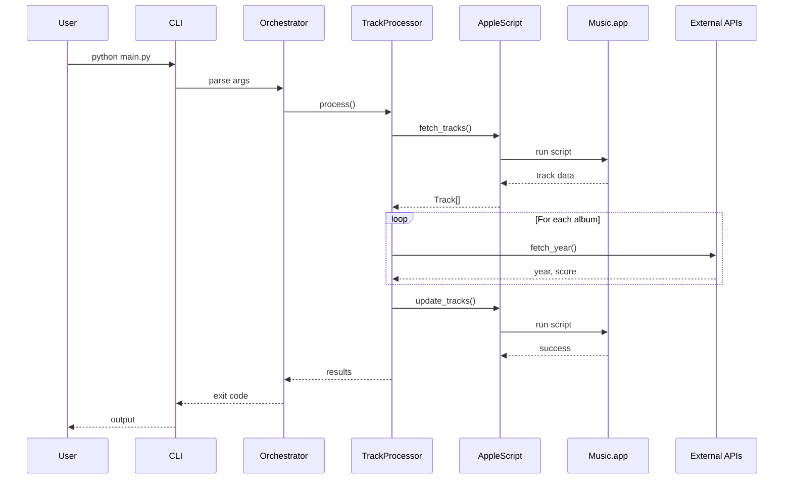
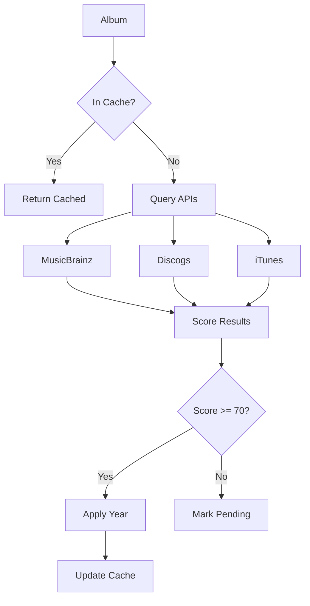
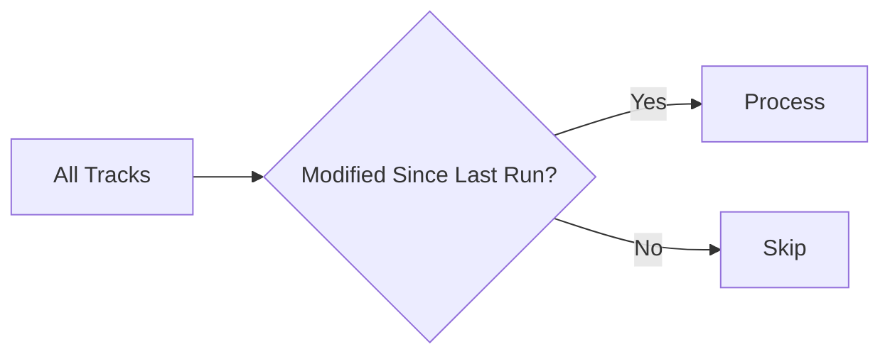
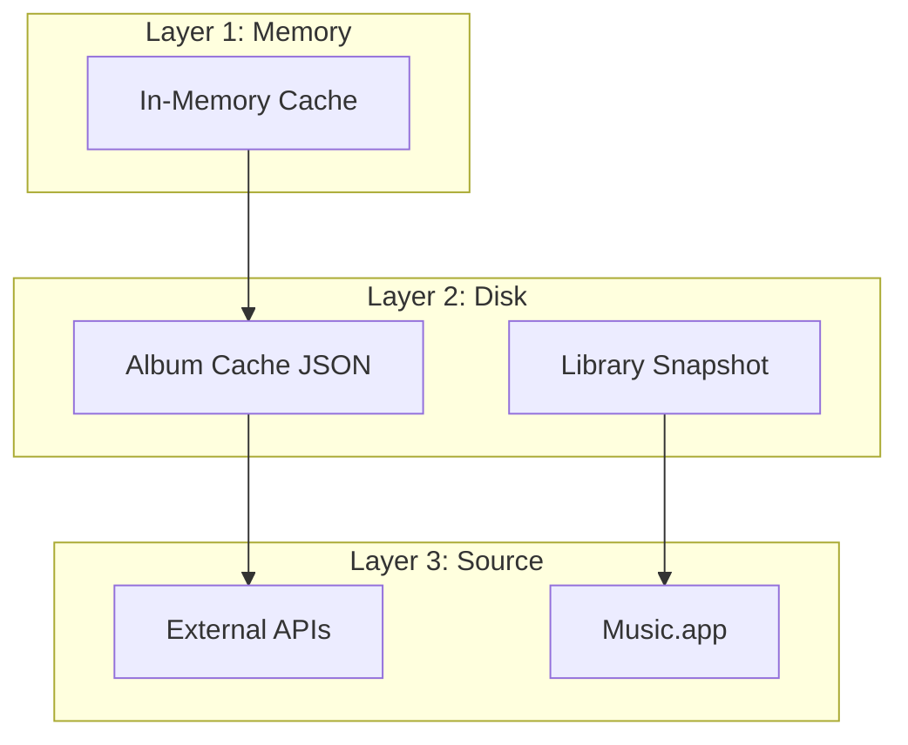
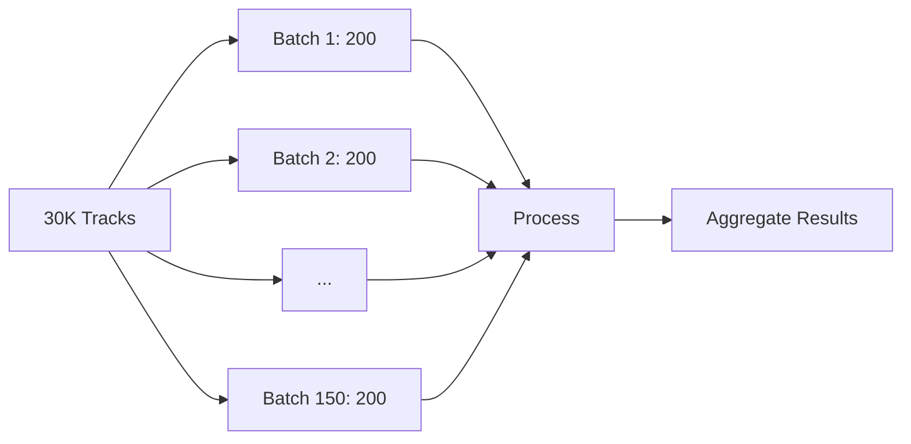
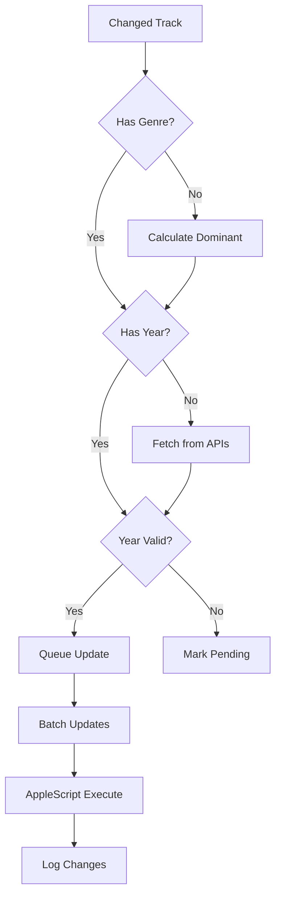
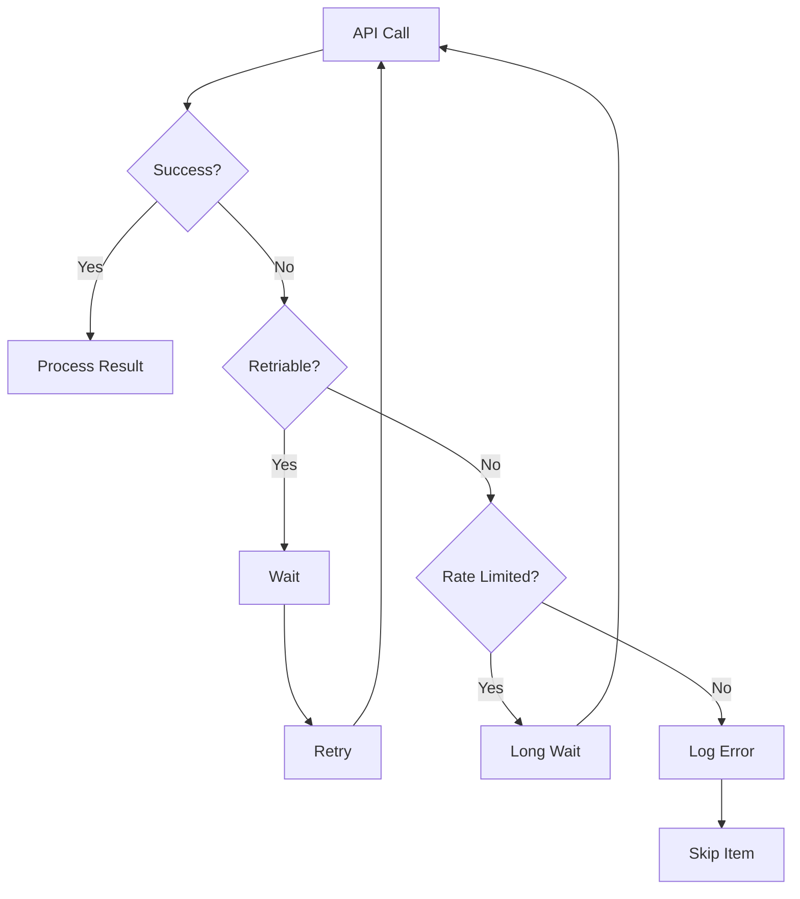

# Data Flow

How data moves through Music Genre Updater from input to output.

## High-Level Flow



## Track Fetching

### From Music.app


AppleScript returns delimited text:

```
Artist\x1DAlbum\x1DTrack\x1DGenre\x1DYear\x1E
Artist2\x1DAlbum2\x1D...
```

- `\x1D` = field separator
- `\x1E` = record separator

### Parsing Pipeline

```python test="skip"
raw_output: str
    → split by '\x1E'
    → for each record: split by '\x1D'
    → validate with Pydantic
    → Track objects
```

## Year Retrieval Flow



## Incremental Processing

Only process recently changed tracks:



### Modification Detection

```python test="skip"
last_run = load_last_run_timestamp()
for track in tracks:
    if track.date_modified > last_run:
        yield track
```

## Caching Layers



### Cache Priorities

1. **Memory**: Hot data, TTL 30 min
2. **Album Cache**: Year data, TTL 100 years (immutable)
3. **Library Snapshot**: Full track list, TTL 24 hours
4. **Negative Cache**: "Not found" results, TTL 30 days

## Batch Processing

Large operations use batching to avoid timeouts:



### Batch Sizes

| Operation | Default Size | Configurable |
|-----------|--------------|--------------|
| Track Fetch | 200 | `ids_batch_size` |
| Year Update | 25 | `batch_size` |
| Genre Update | 50 | `batch_size` |

## Update Pipeline



## Error Recovery



### Retry Policy

| Error Type | Retries | Backoff |
|------------|---------|---------|
| Network | 3 | Exponential |
| Rate Limit | ∞ | Fixed 60s |
| Not Found | 0 | N/A |
| Server Error | 2 | Linear |
