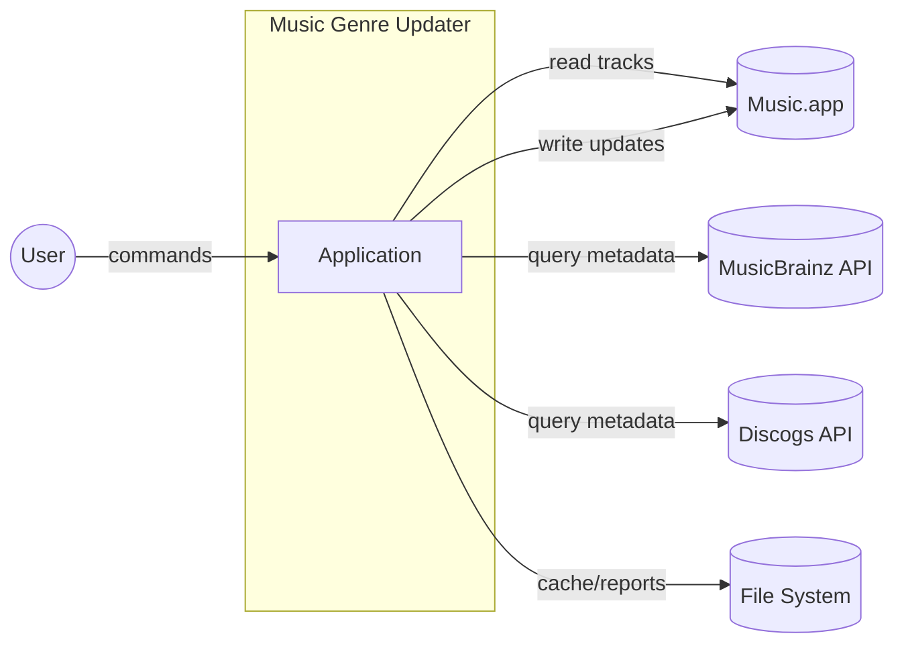
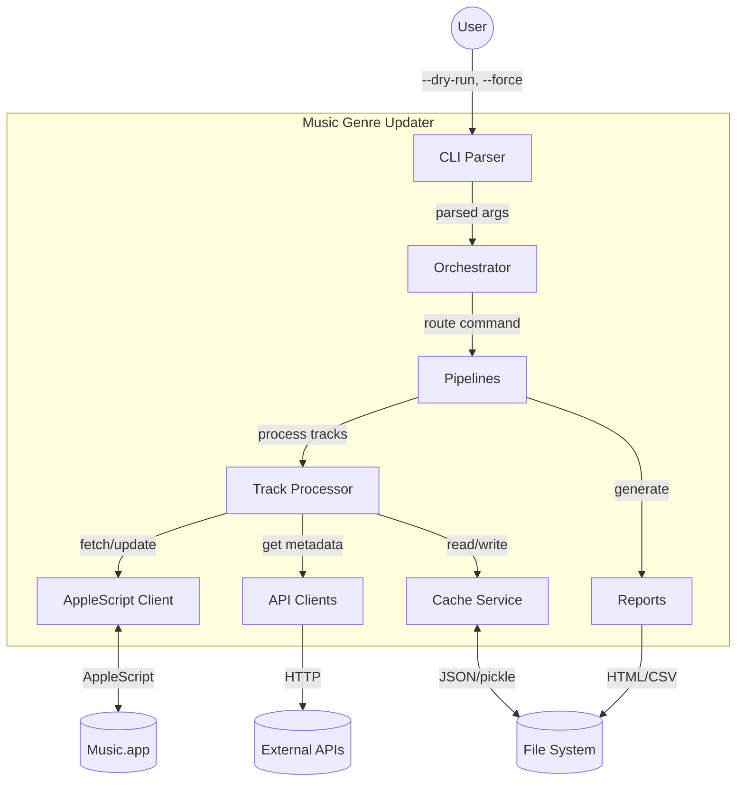
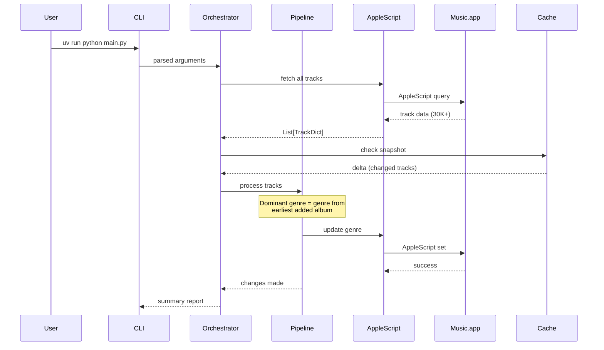
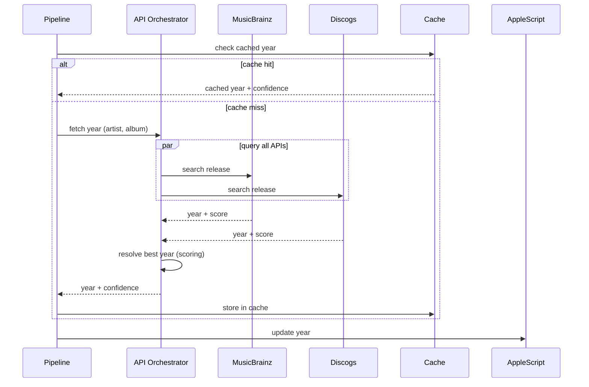
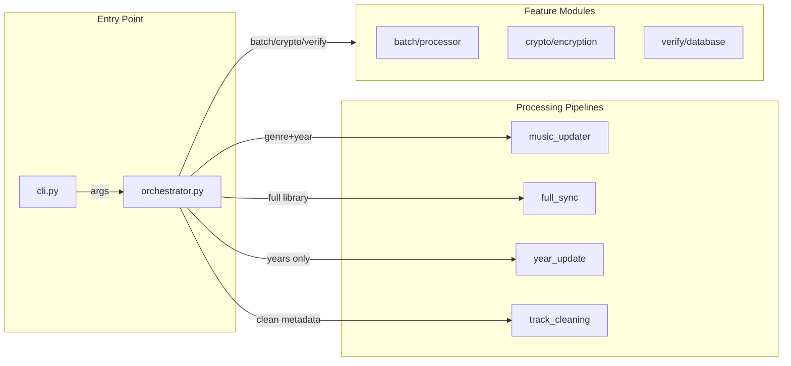
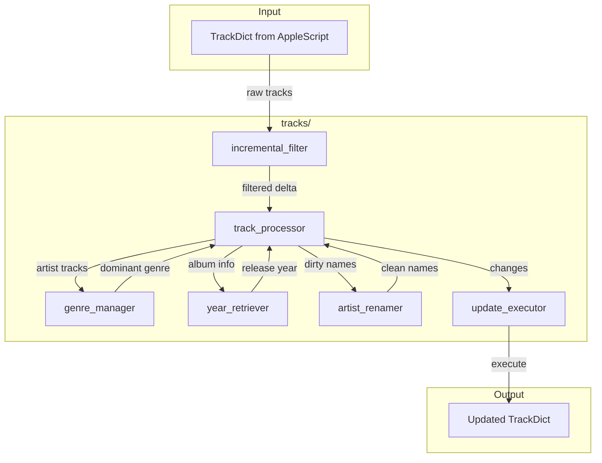
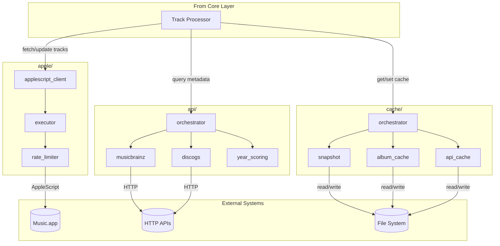
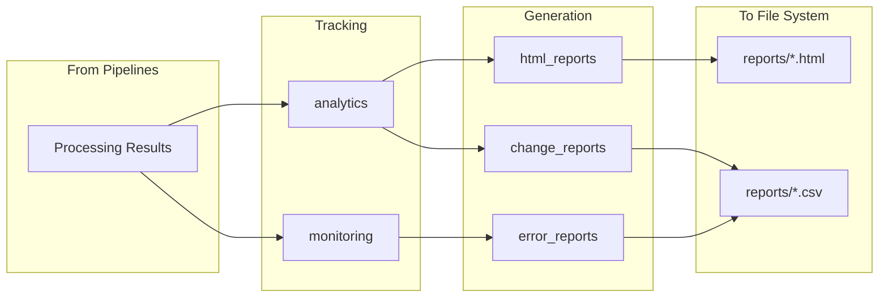

# Architecture Overview

Music Genre Updater follows a **clean architecture** pattern with clear separation of concerns.

## C4 Model Diagrams

### System Context (Level 1)

How the system interacts with external actors:



### Container Diagram (Level 2)

Main containers and data flow:



## Data Flow Diagrams

### Genre Update Flow



### Year Update Flow



## Component Diagrams

### App Layer (`src/app/`)



### Core Layer (`src/core/`)

Business logic for track processing:



### Services Layer (`src/services/`)

I/O adapters and external integrations:



### Metrics Layer (`src/metrics/`)

Observability and reporting:



## Directory Structure

```text
src/
├── app/                        # Presentation layer
│   ├── cli.py                  # CLI argument parsing
│   ├── orchestrator.py         # Command routing
│   ├── *_update.py             # Pipeline modules (music, genre, year, full_sync)
│   ├── track_cleaning.py       # Metadata cleanup
│   └── features/               # Feature modules
│       ├── batch/              # Batch processing
│       ├── crypto/             # API key encryption
│       └── verify/             # Database verification
│
├── core/                       # Business logic
│   ├── analytics_decorator.py  # Standalone track_instance_method
│   ├── core_config.py          # Configuration loading
│   ├── logger.py               # Logging setup
│   ├── dry_run.py              # Dry-run simulation
│   ├── models/                 # Data models, protocols, cache types
│   ├── tracks/                 # Track processing (processor, genre, year)
│   └── utils/                  # Shared utilities
│
├── services/                   # External integrations
│   ├── dependency_container.py # DI container
│   ├── apple/                  # Music.app AppleScript integration
│   ├── api/                    # External APIs (MusicBrainz, Discogs, etc.)
│   └── cache/                  # Multi-tier caching (snapshot, album, API)
│
└── metrics/                    # Analytics & reporting
    └── *.py                    # Reports (HTML, CSV, analytics)
```

## Layer Responsibilities

| Layer        | Path            | What it does                                                           |
|--------------|-----------------|------------------------------------------------------------------------|
| **App**      | `src/app/`      | Entry point, command routing, pipeline selection                       |
| **Core**     | `src/core/`     | Business logic: genre calculation, year determination, track filtering |
| **Services** | `src/services/` | I/O adapters: AppleScript, cache, external API clients                 |
| **Metrics**  | `src/metrics/`  | Observability: timing, reports, error tracking                         |

## Key Design Patterns

### Dependency Injection

All services are wired via `DependencyContainer`:

```python test="skip"
container = DependencyContainer(config, logger)
await container.initialize()

# Services available
genre_manager = container.genre_manager
year_retriever = container.year_retriever
```

### Protocol-Based Interfaces

Interfaces defined with `typing.Protocol` in `core/models/protocols.py`:

- `CacheServiceProtocol` — unified cache operations
- `ExternalApiServiceProtocol` — external API clients
- `AppleScriptClientProtocol` — Music.app communication
- `PendingVerificationServiceProtocol` — verification queue
- `AnalyticsProtocol` — wrapped call execution and batch mode
- `LibrarySnapshotServiceProtocol` — snapshot persistence

`core/` depends only on protocols, never on concrete service classes.
The `track_instance_method` decorator in `core/analytics_decorator.py`
uses duck typing (MRO-based method lookup) to avoid importing the
concrete `Analytics` class. When analytics is missing on a decorated
instance, the wrapper logs an error and falls back to untracked execution.
Test factories use `cast(Protocol, cast(object, mock))` to satisfy strict
type checkers when passing mock objects as protocol-typed parameters.

```python test="skip"
class ExternalApiServiceProtocol(Protocol):
    async def get_album_year(
            self, artist: str, album: str, ...
    ) -> tuple[str | None, bool, int, dict]: ...
```

### Configuration Type Safety

All YAML config sections have corresponding Pydantic v2 models in
`core/models/track_models.py`. The root model `AppConfig` validates
every config section at load time, catching typos and type mismatches
before they reach runtime:

| Config Section              | Pydantic Model                |
|-----------------------------|-------------------------------|
| `processing`                | `ProcessingConfig`            |
| `logic`                     | `LogicConfig`                 |
| `scoring`                   | `ScoringConfig`               |
| `caching`                   | `CachingConfig`               |
| `caching.library_snapshot`  | `LibrarySnapshotConfig`       |
| `year_retrieval`            | `YearRetrievalConfig`         |
| `analytics`                 | `AnalyticsConfig`             |
| `database_verification`     | `DatabaseVerificationConfig`  |
| `development`               | `DevelopmentConfig`           |
| `applescript_timeouts`      | `ApplescriptTimeoutsConfig`   |
| `apple_script_rate_limit`   | `AppleScriptRateLimitConfig`  |
| `album_type_detection`      | `AlbumTypeDetectionConfig`    |
| `batch_processing`          | `BatchProcessingConfig`       |
| `experimental`              | `ExperimentalConfig`          |

### Async-First

All I/O operations use `async/await`:

```python test="skip"
async def process_tracks(self, tracks: list[Track]) -> None:
    async with aiohttp.ClientSession() as session:
        results = await asyncio.gather(*[
            self.process_track(track, session)
            for track in tracks
        ])
```

## AppleScript Integration

Scripts in `applescripts/` directory (canonical names defined in `core/apple_script_names.py`):

| Script                            | Purpose                              | Output Format                                    |
|-----------------------------------|--------------------------------------|--------------------------------------------------|
| `fetch_tracks.applescript`        | Get all tracks or filtered by artist | ASCII-delimited: `\x1E` (field), `\x1D` (record) |
| `fetch_track_ids.applescript`     | Get all track IDs                    | Comma-separated IDs                              |
| `fetch_tracks_by_ids.applescript` | Get specific tracks by ID list       | Same as `fetch_tracks`                           |
| `update_property.applescript`     | Set single track property            | "Success: ..." or "No Change: ..."               |
| `batch_update_tracks.applescript` | Batch updates (experimental)         | JSON status array                                |

## Error Handling

Errors categorized by recoverability:

| Category   | Action             |
|------------|--------------------|
| Transient  | Retry with backoff |
| Rate Limit | Wait and retry     |
| Not Found  | Log and skip       |
| Permanent  | Fail fast          |

## Testing Strategy

```
tests/
├── unit/          # Fast, isolated tests
├── integration/   # Service tests with real cache
└── e2e/          # Full tests with Music.app
```

Tests run with `pytest-xdist` (parallel workers). Module-level singletons
like `album_type._configured_patterns` require `reset_patterns()` autouse
fixtures to prevent cross-worker state pollution.
