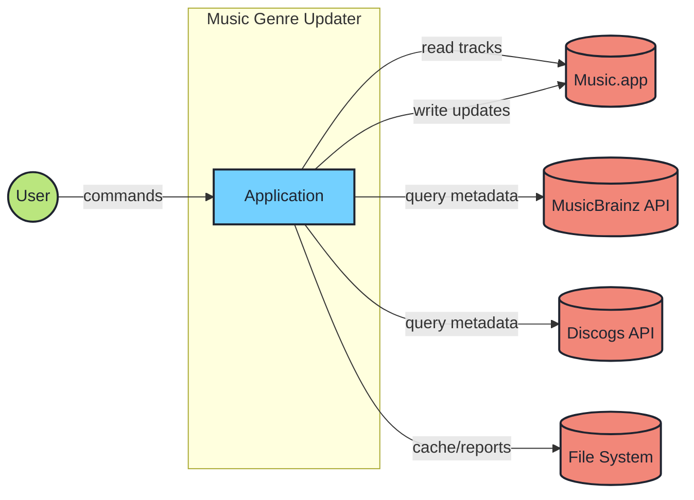
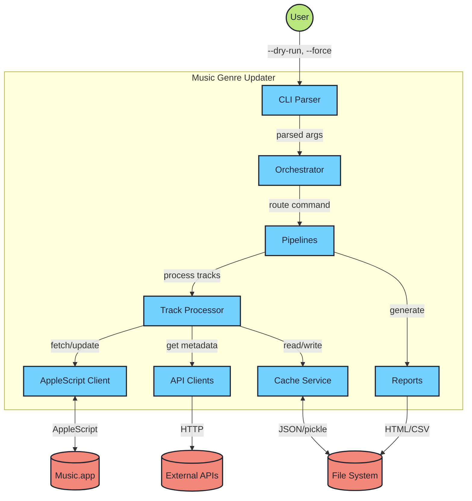
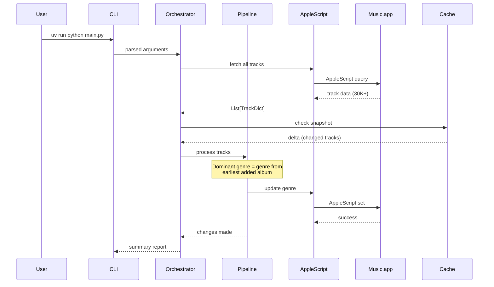
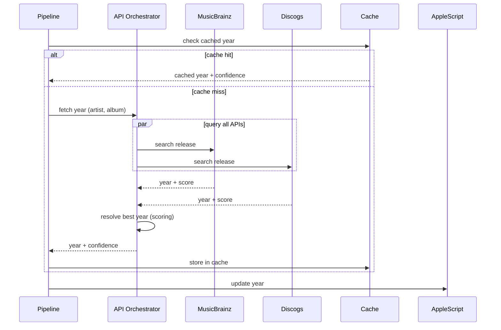
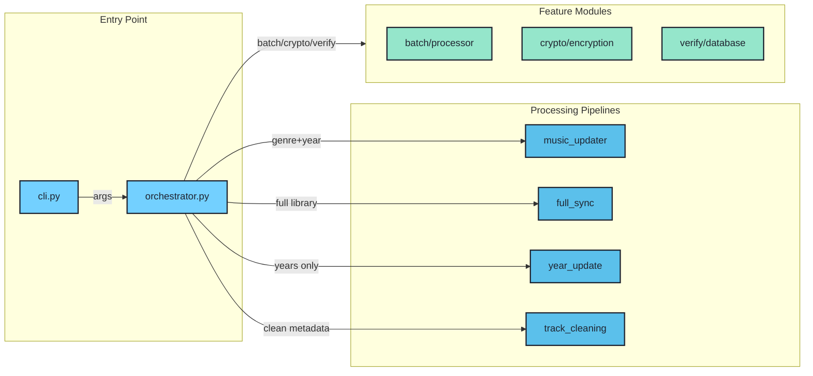
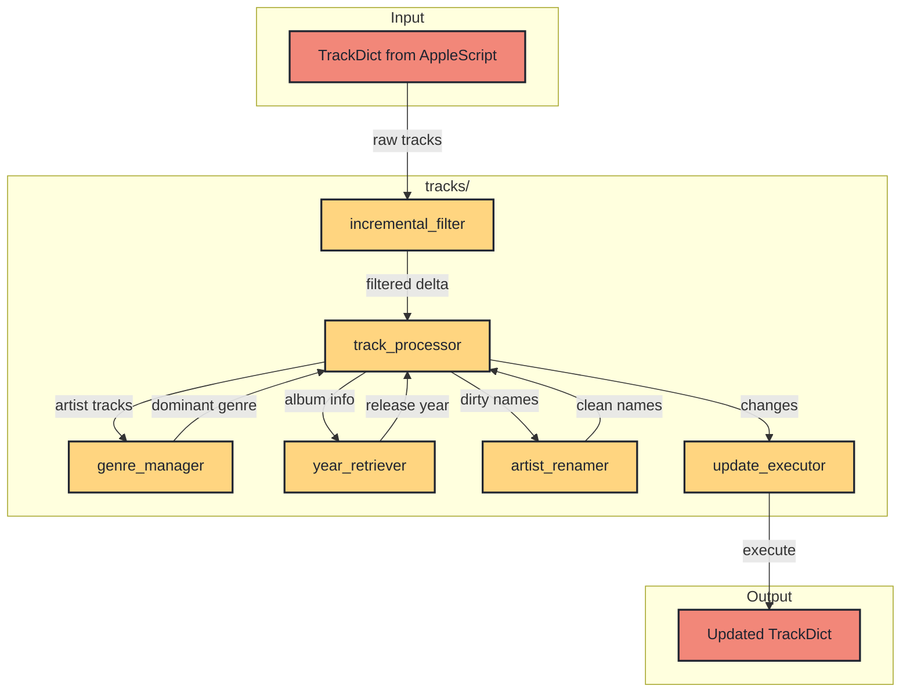
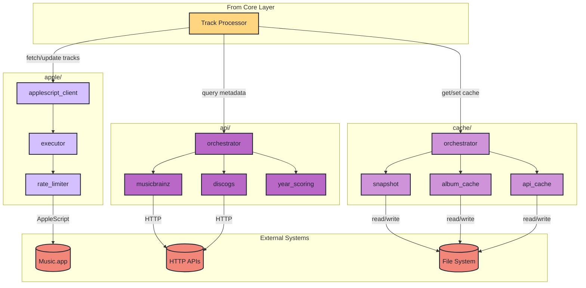
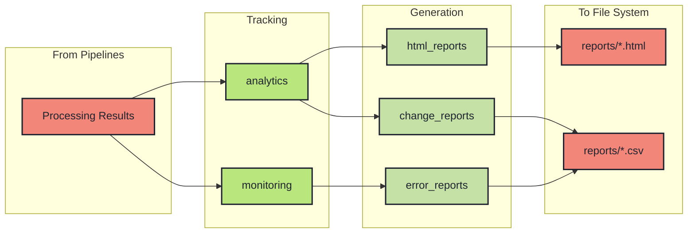

# Architecture Overview

Music Genre Updater follows a **clean architecture** pattern with clear separation of concerns.

## C4 Model Diagrams

### System Context (Level 1)

How the system interacts with external actors:



### Container Diagram (Level 2)

Main containers and data flow:



## Data Flow Diagrams

### Genre Update Flow



### Year Update Flow



## Component Diagrams

### App Layer (`src/app/`)



### Core Layer (`src/core/`)

Business logic for track processing:



### Services Layer (`src/services/`)

I/O adapters and external integrations:



### Metrics Layer (`src/metrics/`)

Observability and reporting:



## Directory Structure

```
src/
├── app/                    # Presentation layer
│   ├── cli.py             # Command-line interface
│   ├── orchestrator.py    # Command routing
│   └── features/          # Feature modules
│
├── core/                   # Business logic
│   ├── models/            # Pydantic data models
│   │   ├── track_models.py
│   │   ├── protocols.py
│   │   └── validators.py
│   ├── tracks/            # Track processing
│   │   ├── genre_manager.py
│   │   ├── year_retriever.py
│   │   └── track_processor.py
│   └── utils/             # Shared utilities
│
├── services/              # External integrations
│   ├── applescript_client.py
│   ├── api/               # API clients
│   │   ├── orchestrator.py
│   │   ├── musicbrainz.py
│   │   ├── discogs.py
│   │   └── applemusic.py
│   ├── cache/             # Caching
│   │   ├── album_cache.py
│   │   └── snapshot.py
│   └── dependency_container.py
│
└── metrics/               # Analytics & reporting
    ├── analytics.py
    └── html_reports.py
```

## Layer Responsibilities

| Layer | Path | What it does |
|-------|------|--------------|
| **App** | `src/app/` | Entry point, command routing, pipeline selection |
| **Core** | `src/core/` | Business logic: genre calculation, year determination, track filtering |
| **Services** | `src/services/` | I/O adapters: AppleScript, cache, external API clients |
| **Metrics** | `src/metrics/` | Observability: timing, reports, error tracking |

## Key Design Patterns

### Dependency Injection

All services are wired via `DependencyContainer`:

```python
container = DependencyContainer(config, logger)
await container.initialize()

# Services available
genre_manager = container.genre_manager
year_retriever = container.year_retriever
```

### Protocol-Based Interfaces

Interfaces defined with `typing.Protocol`:

```python
class ExternalApiServiceProtocol(Protocol):
    async def fetch_year(
        self, artist: str, album: str
    ) -> tuple[int | None, int]: ...
```

### Async-First

All I/O operations use `async/await`:

```python
async def process_tracks(self, tracks: list[Track]) -> None:
    async with aiohttp.ClientSession() as session:
        results = await asyncio.gather(*[
            self.process_track(track, session)
            for track in tracks
        ])
```

## AppleScript Integration

Scripts in `applescripts/` directory:

| Script | Purpose | Output Format |
|--------|---------|---------------|
| `fetch_tracks.scpt` | Get all tracks or filtered by artist | ASCII-delimited: `\x1E` (field), `\x1D` (record) |
| `fetch_tracks_by_ids.scpt` | Get specific tracks by ID list | Same format |
| `update_property.applescript` | Set single track property | "Success: ..." or "No Change: ..." |
| `batch_update_tracks.applescript` | Batch updates (experimental) | JSON status array |

## Error Handling

Errors categorized by recoverability:

| Category | Action |
|----------|--------|
| Transient | Retry with backoff |
| Rate Limit | Wait and retry |
| Not Found | Log and skip |
| Permanent | Fail fast |

## Testing Strategy

```
tests/
├── unit/          # Fast, isolated tests
├── integration/   # Service tests with real cache
└── e2e/          # Full tests with Music.app
```
