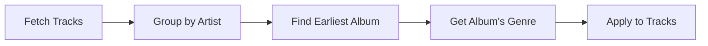

# Genre Updates

How the genre update system works and how to configure it.

## Overview

Music Genre Updater calculates a **dominant genre** for each artist based on their track library, then applies that genre to tracks missing genre information.

## How It Works



1. **Fetch**: All tracks are fetched from Music.app
2. **Group**: Tracks are grouped by artist
3. **Find Earliest**: Identify the artist's earliest album (by `date_added`)
4. **Get Genre**: The earliest track's genre becomes "dominant"
5. **Apply**: Tracks without genres receive the dominant genre

## Running Genre Updates

### Full Library Update

```bash
uv run python main.py update_genres
```

### Specific Artist

```bash
uv run python main.py update_genres --artist "Pink Floyd"
```

### Dry Run (Preview)

```bash
uv run python main.py update_genres --dry-run
```

## Genre Calculation Rules

### How Dominant Genre is Determined

The dominant genre for an artist is determined by their **earliest album**:

1. **Find Earliest Album**: Group all tracks by album, find the earliest track in each album (by `date_added`)
2. **Select Earliest Album**: The album whose earliest track was added first becomes the reference
3. **Use Album's Genre**: The genre of the earliest track in that album becomes the dominant genre

This approach assumes an artist's earliest work best represents their core genre identity.

!!! note "Why Earliest Album?"
    Artists often experiment with different genres over time. Using the earliest album
    captures their original musical identity before potential genre shifts.

### Genre Normalization

Genres are normalized before processing:

- Whitespace trimmed
- Case preserved (genres are case-sensitive in Music.app)
- Empty strings ignored

## Configuration

Genre behavior is configured in `my-config.yaml`:

```yaml
genre_update:
  batch_size: 50          # Tracks per AppleScript batch
  concurrent_limit: 5     # Max concurrent operations
```

## Exclusions

Some albums are excluded from genre updates via the `exceptions` config:

```yaml
exceptions:
  track_cleaning:
    - artist: "Rabbit Junk"
      album: "Xenospheres"
```

## Reports

After each run, check the changes report:

```
~/path/to/logs/csv/changes_report.csv
```

The report shows:
- Track name
- Previous genre (if any)
- New genre applied
- Artist and album context

## Troubleshooting

### No Genre Applied

**Cause**: The artist's earliest album has no genre set on its earliest track.

**Solution**: Set a genre on the earliest track of the artist's first album, then re-run.

### Wrong Genre Applied

**Cause**: The earliest album's genre doesn't reflect the artist's main style.

**Solution**:
1. Fix the genre on the earliest track of the earliest album in Music.app
2. Run with `--force` to recalculate

### Slow Performance

**Cause**: Large library without caching.

**Solution**: Enable library snapshots in config:

```yaml
caching:
  library_snapshot:
    enabled: true
    delta_enabled: true
```
