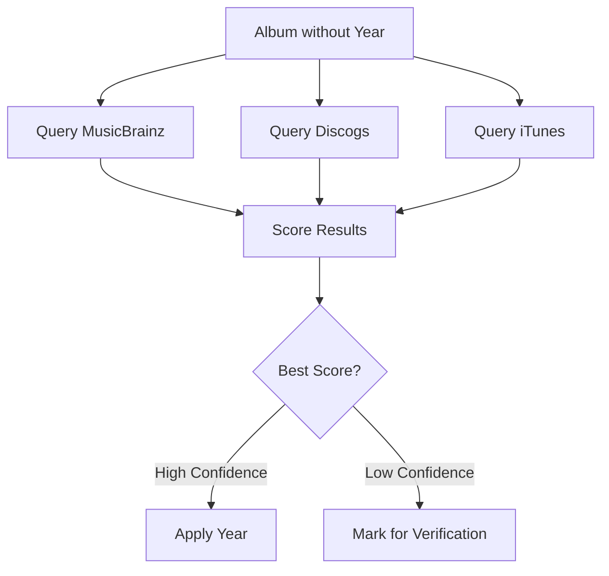

# Year Updates

How the release year retrieval system works.

## Overview

Music Genre Updater fetches album release years from multiple external APIs and uses a scoring system to determine the most accurate year.

## Data Sources

| Source | Priority | Strengths |
|--------|----------|-----------|
| MusicBrainz | Primary | Release groups, accurate original dates |
| Discogs | Secondary | Detailed release info, reissue detection |
| iTunes/Apple Music | Tertiary | Verification, catalog data |

## How It Works



## Running Year Updates

### Full Library

```bash
uv run python main.py update_years
```

### Specific Artist

```bash
uv run python main.py update_years --artist "Metallica"
```

### Force Refresh

Bypass cache and re-fetch from APIs:

```bash
uv run python main.py update_years --force
```

## Scoring System

Each API result receives a score based on:

### Positive Factors

| Factor | Points |
|--------|--------|
| Exact artist match | +20 |
| Exact album match | +25 |
| MusicBrainz release group match | +50 |
| Official release status | +10 |
| Album type (not compilation) | +15 |
| Major market release | +5 |

### Negative Factors

| Factor | Points |
|--------|--------|
| Reissue detected | -30 |
| Compilation/live album | -35 |
| Bootleg status | -50 |
| Year far from release group | -5 to -40 |
| Album name mismatch | -5 to -40 |

### Confidence Thresholds

| Score | Action |
|-------|--------|
| ≥70 | Apply automatically (high confidence) |
| 30-69 | Apply only if track has no existing year |
| <30 | Skip - mark for manual verification |

## Reissue Detection

The system detects reissues via:

1. **Keywords**: "remaster", "anniversary", "deluxe", etc.
2. **Year comparison**: Release year vs. release group date
3. **Release count**: Albums with many releases likely have reissues

When a reissue is detected, the system prefers the **original release year**.

## Configuration

Configure year retrieval in `my-config.yaml`:

```yaml
year_retrieval:
  enabled: true
  preferred_api: musicbrainz

  api_auth:
    discogs_token: ${DISCOGS_TOKEN}
    contact_email: ${CONTACT_EMAIL}

  rate_limits:
    discogs_requests_per_minute: 55
    musicbrainz_requests_per_second: 1

  logic:
    min_valid_year: 1900
    definitive_score_threshold: 70
    min_confidence_for_new_year: 30
```

## Special Album Handling

### Compilations

Albums matching compilation patterns are **skipped**:

- "Greatest Hits"
- "Best of"
- "Collection"
- "Anthology"

### B-Sides / Demos

Special albums are skipped:

- "B-Sides"
- "Demos"
- "Rarities"
- "Outtakes"

## Pending Verification

Albums that fail automated year fetching are saved to:

```
~/logs/csv/pending_year_verification.csv
```

Re-process them later:

```bash
uv run python main.py verify_pending
```

## Reverting Changes

If a wrong year was applied:

```bash
# Revert specific album
uv run python main.py revert_years --artist "Artist" --album "Album"

# Revert all for an artist
uv run python main.py revert_years --artist "Artist"
```

## Troubleshooting

### No Year Found

**Cause**: Album not in external databases.

**Solution**:
1. Check album name spelling matches catalog
2. Manually set year in Music.app

### Wrong Year Applied

**Cause**: Reissue year detected as original.

**Solution**:
```bash
uv run python main.py restore_release_years --artist "Artist" --album "Album"
```

### Rate Limiting

**Cause**: Too many API requests.

**Solution**: Increase delays in config:

```yaml
year_retrieval:
  processing:
    delay_between_batches: 30
```
