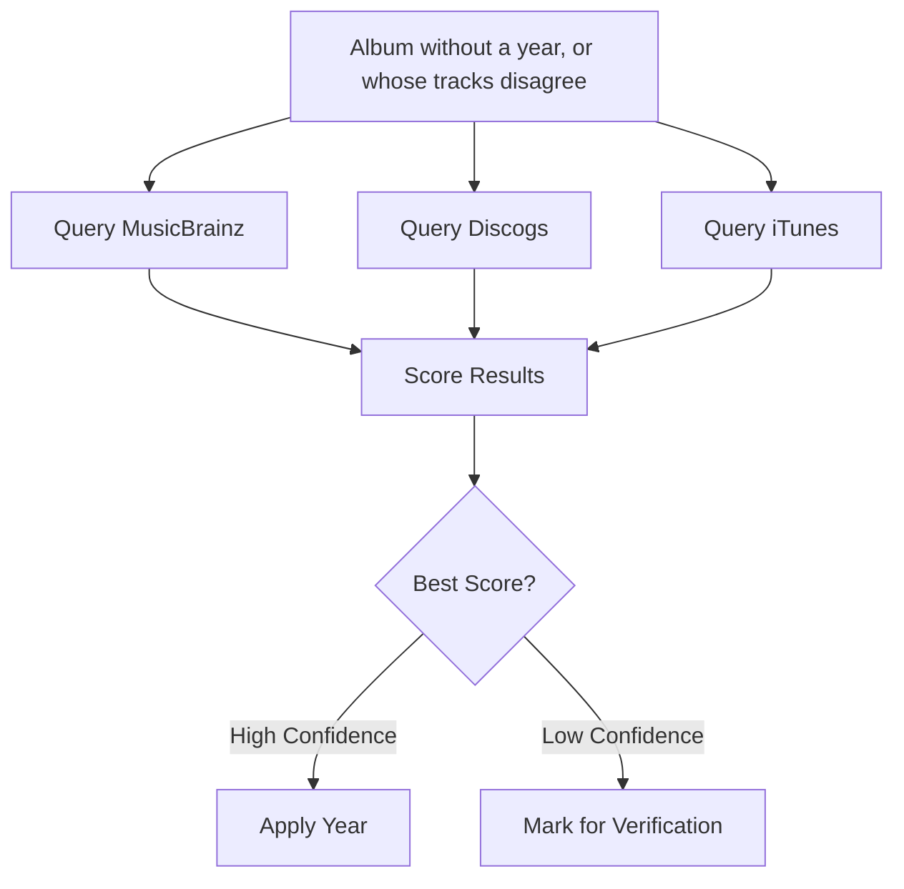

# Year Updates

How the release year retrieval system works.

## Overview

Music Genre Updater fetches album release years from multiple external APIs and uses a scoring system to determine the most accurate year.

## Data Sources

| Source             | Priority  | Strengths                                |
|--------------------|-----------|------------------------------------------|
| MusicBrainz        | Primary   | Release groups, accurate original dates  |
| Discogs            | Secondary | Detailed release info, reissue detection |
| iTunes/Apple Music | Tertiary  | Verification, catalog data               |

## How It Works


```mermaid
flowchart TD
    A[Album without a year, or whose tracks disagree] --> B[Query MusicBrainz]
    A --> C[Query Discogs]
    A --> D[Query iTunes]
    B --> E[Score Results]
    C --> E
    D --> E
    E --> F{Best Score?}
    F -->|High Confidence| G[Apply Year]
    F -->|Low Confidence| H[Mark for Verification]
```

## What decides an album's year

1. A fresh, confident entry in the album-year cache.
2. The providers (MusicBrainz, Discogs, iTunes), judged by the fallback rules. The year most of the album's tracks carry and Apple's release date are handed to them as hints rather than applied on their own, since Apple rewrites both without notice. Two fallback rules still side with Apple when the providers are not sure of their answer: an album whose release date is this year keeps Apple's date over an older provider year, and, for an album that already has a year, a provider year more than `year_difference_threshold` years from Apple's release date is rejected and the album marked for verification.
3. When no provider knows the album, the year most of its tracks carry (at least 60% of them) fills in the others, unless that year is this year and the album's earliest track was added in an earlier year or no track carries a date (Apple's placeholder for a date it lacks): then the album is left alone.

A lookup that fails, or that no provider could be reached for, leaves the album for the next run. An album whose tracks all agree is skipped (a single track agrees with itself), unless the cache holds another year (a confident entry is applied, a weaker one sends the album to the providers), or the shared year is this year or last and no track carries Apple's release date, a reissue sign that sends it to the providers too. A year the tool wrote is recorded in `track_list.csv` (`year_set_by_mgu`); telling a later outside change from the tool's own write is the next release's job.

## Running Year Updates

### Full Library

```bash
uv run python main.py update_years
```

### Specific Artist

```bash
uv run python main.py update_years --artist "Metallica"
```

### Force Refresh

Bypass cache and re-fetch from APIs:

```bash
uv run python main.py update_years --force
```

## Scoring System

Each API result receives a score based on:

### Positive Factors

| Factor                          | Points |
|---------------------------------|--------|
| Exact artist match              | +20    |
| Exact album match               | +25    |
| MusicBrainz release group match | +50    |
| Official release status         | +10    |
| Album type (not compilation)    | +15    |
| Major market release            | +5     |

### Negative Factors

| Factor                      | Points    |
|-----------------------------|-----------|
| Reissue detected            | -30       |
| Compilation/live album      | -25       |
| Bootleg status              | -50       |
| Year far from release group | -5 to -40 |
| Album title partly matches  | -5        |

A release whose title is unrelated to the album (neither title contains the other) is not scored at all: another release by the artist says nothing about this album's year.

### Confidence Thresholds

| Score | Action                                   |
|-------|------------------------------------------|
| ≥70   | Apply automatically (high confidence)    |
| 30-69 | Apply only if track has no existing year |
| <30   | Skip - mark for manual verification      |

## Reissue Detection

The system detects reissues via:

1. **Keywords**: a release title containing a `year_retrieval.reissue_detection.reissue_keywords` entry is scored as a reissue, whichever provider it came from
2. **Year comparison**: Release year vs. release group date
3. **Release count**: Albums with many releases likely have reissues

When a reissue is detected, the system prefers the **original release year**.

## Configuration

Configure year retrieval in `my-config.yaml`:

```yaml
year_retrieval:
  enabled: true
  preferred_api: musicbrainz

  api_auth:
    discogs_token: ${DISCOGS_TOKEN}
    contact_email: ${CONTACT_EMAIL}

  rate_limits:
    discogs_requests_per_minute: 55
    musicbrainz_requests_per_second: 1

  logic:
    min_valid_year: 1900
    definitive_score_threshold: 70
    min_confidence_for_new_year: 30
```

## Special Album Handling

### Compilations

Albums matching compilation patterns are **skipped**:

- "Greatest Hits"
- "Best of"
- "Collection"
- "Anthology"

### B-Sides / Demos

Special albums are skipped:

- "B-Sides"
- "Demos"
- "Rarities"
- "Outtakes"

## Pending Verification

Albums that fail automated year fetching are saved to:

```
~/logs/csv/pending_year_verification.csv
```

Re-process them later:

```bash
uv run python main.py verify_pending
```

An album whose lookup reaches no provider (network outage, rate limit, server errors) is neither saved there nor changed: the console prints `Year lookup unavailable for '<artist> - <album>'`, and the next run asks the providers again. When `verify_pending` meets such an album, its summary counts it as unavailable and the run does not postpone the next verification.

Each saved album counts its verification attempts. Runs between rechecks (every `pending_verification_interval_days`) do not add to the count; after three attempts the best year a provider found for the album is accepted, and an album no provider found a year for stays pending. The file stores the count as `verification_attempts`.

## Reverting Changes

If a wrong year was applied:

```bash
# Revert specific album
uv run python main.py revert_years --artist "Artist" --album "Album"

# Revert all for an artist
uv run python main.py revert_years --artist "Artist"
```

## Troubleshooting

### No Year Found

**Cause**: Album not in external databases.

**Solution**:
1. Check album name spelling matches catalog
2. Manually set year in Music.app

### Wrong Year Applied

**Cause**: Reissue year detected as original.

**Solution**:
```bash
uv run python main.py restore_release_years --artist "Artist" --album "Album"
```

### Rate Limiting

**Cause**: Too many API requests.

**Solution**: Increase delays in config:

```yaml
year_retrieval:
  processing:
    delay_between_batches: 30
```
